# Beste VPN 2026 für Deutschland: Streaming, Datenschutz und tägliche Speedtests
**Letztes Update: 6. Juli 2026 - VPN Welt**

VPN Welt ist ein praktischer Vergleich für Nutzer in Deutschland, Österreich und der Schweiz. Der Fokus liegt nicht auf Marketing-Versprechen, sondern auf vier Fragen: Funktioniert die VPN-App im Alltag, ist sie schnell genug für Streaming, schützt sie im öffentlichen WLAN und ist der Preis fair?

Diese Seite ist für Nutzer, die:

- Netflix, Disney+, Prime Video, DAZN, WOW, Zattoo, Joyn oder Mediatheken auf Reisen nutzen wollen.
- Im Hotel, Flughafen, Zug oder Cafe sicherer surfen möchten.
- Ein VPN für Windows, macOS, iPhone, Android, Smart TV oder Router suchen.
- Preise, Erstattung, Geräte-Limit und Geschwindigkeit vergleichen wollen.
- Keine riskante Gratis-VPNs für Banking, E-Mail oder Streaming einsetzen möchten.

Streaming-Anbieter blockieren regelmäßig VPN-IP-Adressen. Deshalb bewerten wir nicht nur Maximalgeschwindigkeit, sondern auch Server-Auswahl, App-Qualität, Support, Geld-zurück-Garantie und die Möglichkeit, schnell den Standort zu wechseln.

## Kurzempfehlung nach Bedarf

| Bedarf | Empfehlung | Warum |
|---|---|---|
| Gutes Preis-Leistungs-Verhältnis | [StrongVPN](https://strongvpn.com/de/?tr_aid=60d96b5810e50&chan=w_github_de&data1=de-home&data2=hero) | Solider Jahrespreis, einfache Apps und genug Leistung für Alltag, Reisen und Streaming. |
| Premium-App und hohe Stabilitat | [ExpressVPN](https://go.expressvpn.com/c/3828265/1509266/16063) | Sehr einsteigerfreundlich, starke internationale Abdeckung und gute Performance. |
| Viele Geräte im Haushalt | [Surfshark](https://get.surfshark.net/aff_c?offer_id=323&aff_id=5585&source=w_github&aff_sub=de) | Unbegrenzte gleichzeitige Verbindungen für Familie, Laptop, Handy und TV. |
| Erst testen, dann entscheiden | [FlowVPN](https://www.flowvpx.com/sign-up/?locale=de&special=FREETRIAL&r=35-890485.w_github_de) | Kurzer Test, um Geschwindigkeit und Kompatibilität im eigenen Netz zu prüfen. |

## Die wichtigsten deutschen VPN-Suchintentionen

### 1. Streaming und Mediatheken auf Reisen

Viele Nutzer suchen ein VPN, weil Inhalte im Ausland anders aussehen oder wegen regionaler Rechte nicht verfügbar sind. Das betrifft internationale Plattformen wie Netflix und Disney+, aber auch Sport, Mediatheken und Live-TV-Angebote. Eine gute VPN sollte mehrere Standorte bieten und den Wechsel zwischen Servern einfach machen.

Eine Garantie für jeden Katalog gibt es nicht. Entscheidend ist, ob du schnell alternative Server testen kannst und ob der Anbieter bei Streaming-Problemen reagiert.

### 2. Datenschutz im öffentlichen WLAN

Deutschland hat ein starkes Datenschutzbewusstsein, aber im Alltag nutzen viele Menschen trotzdem offene WLANs in Bahn, Hotel, Flughafen oder Coworking-Space. Ein VPN verschlüsselt die Verbindung und reduziert das Risiko beim Einloggen in E-Mail, Banking, Cloud-Tools oder Unternehmensdienste.

### 3. Preis, Vertragslaufzeit und Erstattung

Der günstigste Monatspreis steht fast immer in langen Vertragen. Prüfe vor dem Kauf: Gesamtkosten, Verlängerungspreis, Geld-zurück-Frist, Geräte-Limit und ob deine wichtigsten Apps wirklich funktionieren.

## Vergleich der vier VPN-Anbieter

| VPN | Stärke | Preisorientierung | Worauf achten? |
|---|---|---|---|
| [StrongVPN](https://strongvpn.com/de/?tr_aid=60d96b5810e50&chan=w_github_de&data1=de-home&data2=price) | Preis und einfache Nutzung | 4,99 USD/Monat (ca. 4,34 EUR), 53,99 USD (ca. 46,97 EUR) im ersten Jahr; klar beste 1-Jahres-Preiswahl, deutlich günstiger als ExpressVPN | Vor Ablauf der Erstattung mit deinen Streaming-Apps testen. |
| [ExpressVPN](https://go.expressvpn.com/c/3828265/1509266/16063) | Premium-App und Support | Premium-Preis: ein 1-Jahres-Kauf ist klar teurer als StrongVPN; lange Tarife oft ca. 3,49-4,99 USD/Monat (ca. 3,04-4,34 EUR), monatlich 12,99 USD (ca. 11,30 EUR) | Teuerste Marke; sinnvoll, wenn du Komfort/Support bezahlst. |
| [Surfshark](https://get.surfshark.net/aff_c?offer_id=323&aff_id=5585&source=w_github&aff_sub=de) | Unbegrenzte Geräte | günstig nur bei 2-Jahres-/Langzeitplan: ab ca. 1,99 USD/Monat (ca. 1,73 EUR); Starter ca. 53,73 USD (ca. 46,75 EUR) + Steuer | Bestpreis meist nur bei langer Laufzeit. |
| [FlowVPN](https://www.flowvpx.com/sign-up/?locale=de&special=FREETRIAL&r=35-890485.w_github_de) | Schnell testen | 3-Tage-Test; 6,99 USD monatlich (ca. 6,08 EUR); Jahrespromo ca. 39,99 USD (ca. 34,79 EUR) | Gut zum Testen/Backup, nicht unsere erste Langzeit-Empfehlung. |

## Plattformen und Szenarien vor dem Kauf testen

In Deutschland geht es selten nur um “irgendein VPN”. Entscheidend sind Mediatheken, Sport, Reisen, öffentliches WLAN, Datenschutz und ein klarer Erstattungszeitraum.

| Szenario | Plattformen / Nutzung | Erste Wahl zum Testen |
|---|---|---|
| Deutsche Mediatheken im Ausland | ARD, ZDF, Joyn, RTL+, MagentaTV | [StrongVPN](https://strongvpn.com/de/?tr_aid=60d96b5810e50&chan=w_github_de&data1=de-home&data2=local_platforms) / [ExpressVPN](https://go.expressvpn.com/c/3828265/1509266/16063) |
| Sport und Live-TV | DAZN, Sky/WOW, RTL+, internationale Streams | ExpressVPN für Stabilität; StrongVPN für Preis/Leistung |
| Internationale Kataloge | Netflix, Disney+, Prime Video, Apple TV+ | ExpressVPN / Surfshark |
| Haushalt mit vielen Geräten | Handy, Laptop, Tablet, Fire TV, Smart TV | [Surfshark](https://get.surfshark.net/aff_c?offer_id=323&aff_id=5585&source=w_github&aff_sub=de) |
| Kurzer Kompatibilitätstest | eigenes Netz, eigenes Gerät, eigener Anbieter | [FlowVPN](https://www.flowvpx.com/sign-up/?locale=de&special=FREETRIAL&r=35-890485.w_github_de) |

### Testplan während der Erstattungsfrist

1. Teste zuhause, per Mobilfunk und in einem öffentlichen WLAN.
2. Öffne deine wichtigsten Mediatheken und Sport-Apps.
3. Wechsle Server, wenn ein Streaming-Dienst blockiert.
4. Prüfe 15-30 Minuten Wiedergabe, nicht nur den Login.
5. Wenn der Hauptzweck scheitert, innerhalb der Frist erstatten lassen.

## WM 2026: VPN für Reisen, Streaming und ExpressVPN Ticket-Gewinnspiel


*Illustration created for this site.*

Die FIFA World Cup 2026 läuft vom 11. Juni bis 19. Juli in den USA, Kanada und Mexiko. Für deutsche Fans geht es nicht nur um Streaming, sondern auch um Reisen, Hotel-WLAN, Flughafen-WLAN, Ticketkonten, Banking, E-Mail und öffentliche Netzwerke.

ExpressVPN teilt mit, Official Supporter der FIFA World Cup 2026 zu sein und ein Gewinnspiel mit 25 Ticketpaaren durchzuführen, darunter K.-o.-Spiele und ein Paar für das Finale. Das Gewinnspiel wird von ExpressVPN betrieben; Bedingungen, Verfügbarkeit und Teilnahmeberechtigung bitte auf der offiziellen Seite prüfen.

| WM-Szenario | Erster Klick | Warum |
|---|---|---|
| Offizielle Kampagne und Ticket-Gewinnspiel | [ExpressVPN WM 2026 Angebot](https://go.expressvpn.com/c/3828265/1481161/16063) | Passt am besten zum Official-Supporter-Hook |
| Preisbewusster VPN-Schutz auf Reisen | [StrongVPN](https://strongvpn.com/de/?tr_aid=60d96b5810e50&chan=w_github_de&data1=de-home&data2=worldcup_block) | Gute Option für öffentliches WLAN und Alltag |
| Viele Geräte im Haushalt | [Surfshark](https://get.surfshark.net/aff_c?offer_id=323&aff_id=5585&source=w_github&aff_sub=de) | Sinnvoll für Handy, Laptop, Tablet und TV |

Vor dem ersten Spiel: VPN installieren, Streaming-App öffnen, DNS/WebRTC prüfen, Server wechseln, wenn ein Regionsfehler erscheint, und 15-30 Minuten testen.

## Hinweis zu Preisen und lokaler Währung

Preise geprüft am 2026-06-22. Für Deutschland/Österreich rechnen wir mit 1 USD ≈ 0,87 EUR.

- StrongVPN Jahresangebot: 4,99 USD/Monat (ca. 4,34 EUR), 53,99 USD (ca. 46,97 EUR) im ersten Jahr, ca. 4,34 EUR/Monat bzw. 46,97 EUR/Jahr vor MwSt. Wer nur innerhalb eines Jahres kaufen will, bekommt mit StrongVPN die klarste günstige Wahl; ExpressVPN ist im 1-Jahres-Kauf deutlich teurer.
- ExpressVPN ist die Premium- und Hochpreis-Option: lange Tarife oft ca. 3,49-4,99 USD/Monat (ca. 3,04-4,34 EUR), monatlich 12,99 USD (ca. 11,30 EUR), Verlängerung meist höher; Steuer und Verlängerung können den Endbetrag erhöhen.
- Surfshark lange Laufzeit: günstig nur bei 2-Jahres-/Langzeitplan: ab ca. 1,99 USD/Monat (ca. 1,73 EUR); Starter ca. 53,73 USD (ca. 46,75 EUR) + Steuer. Sinnvoll vor allem, wenn du 2 Jahre/Langzeit akzeptierst und unbegrenzt viele Geräte brauchst.
- FlowVPN: 3-Tage-Test, 6,99 USD monatlich, Jahrespromo ca. 39,99 USD (regulär 49,99 USD). Gut zum Testen/Backup; als Haupt-VPN priorisieren wir StrongVPN.

## Tagliche VPN-Speedtests

VPN-Geschwindigkeit hängt von Standort, Tageszeit, Protokoll, Serverlast und deinem eigenen Anschluss ab. Ein einzelner Test ist kaum aussagekräftig. Wir vergleichen deshalb wiederholte Messungen und beobachten 7-, 14-, 30- und 90-Tage-Trends.


**So wird aus dem Speedtest eine Kaufentscheidung:** Bei einem Kauf innerhalb eines Jahres ist StrongVPN klar günstiger als ExpressVPN. In den Speedtests ist StrongVPN nicht immer der schnellste Anbieter, reicht aber für Alltag, öffentliches WLAN, Reisen und normale Streaming-Tests. Wer für Marke, App-Komfort und Premium-Stabilität mehr Jahresgebühr zahlen will, kann ExpressVPN wählen.  
Wenn mehrere Personen oder sehr viele Geräte geschützt werden sollen, passt Surfshark besser, aber der niedrige Preis hängt meist an einem 2-Jahres- oder Langzeitplan. FlowVPN eignet sich eher für Studenten, kurze Tests oder sehr knappes Budget, weil es einen 3-Tage-Test gibt; als Haupt-VPN bleibt StrongVPN die bessere Langzeitwahl.

| VPN-Dienst | Schnelles Protokoll | OpenVPN | Praxisbewertung |
|---|---:|---:|---|
| ExpressVPN | 600 Mbps | 400 Mbps | Stark für Nutzer, die Komfort und Stabilitat bezahlen wollen. |
| FlowVPN | 650 Mbps | 380 Mbps | Sinnvoll zum Testen und für gemischte Nutzung. |
| StrongVPN | 500 Mbps | 350 Mbps | Gutes Preis-Leistungs-Verhältnis für den Alltag. |
| Surfshark | 800 Mbps | 300 Mbps | Sehr attraktiv für viele Geräte und lange Laufzeit. |

## Kauf-Checkliste

1. Vor dem Kauf notieren, welche Apps funktionieren mussen.
2. VPN am selben Tag auf Handy, Laptop und TV testen.
3. Zwei bis drei Standorte für Streaming ausprobieren.
4. Im öffentlichen WLAN oder mobilen Netz testen, wenn du viel reist.
5. Wenn der Hauptzweck nicht klappt, rechtzeitig Erstattung nutzen.

## Häufige Fragen

### Welche VPN ist für Deutschland am besten?

Fur Premium-Komfort ist ExpressVPN stark. Fur Preis-Leistung ist StrongVPN interessant. Fur viele Geräte im Haushalt ist Surfshark besonders praktisch. Wer erst testen will, kann FlowVPN nutzen.

### Bringt ein VPN mehr Datenschutz?

Ja, sie verschlüsselt deine Verbindung und verbirgt deine IP gegenüber vielen Diensten. Sie ersetzt aber keine sicheren Passwörter, 2FA oder gesundes Misstrauen gegen Phishing.

### Sind Gratis-VPNss eine gute Idee?

Fur kurze Tests vielleicht. Fur Streaming, Banking, Arbeit und Reisen eher nicht, weil Datenlimits, langsame Server und unklare Datenschutzmodelle haufig Probleme machen.

Unterhalb folgen aktuelle VPN-News, Kaufanleitungen, Installationsschritte und detaillierte Provider-Abschnitte.

<!-- NEWS_START -->
#### 6. Juli 2026: VPN-, Datenschutz- und Cybersicherheitsnachrichten
- **Altersverifikation rückt VPN-Datenschutz wieder in den Fokus**: TechRadar erklärt, warum Nutzer in Märkten wie Großbritannien und Australien bei VPNs auf Audits, No-Logs, Verschlüsselung, Geräteunterstützung und Risiken kostenloser VPNs achten sollten. [Quelle](https://www.techradar.com/vpn/vpn-privacy-security/how-to-choose-an-age-verification-vpn)

#### 6. Juli 2026: Telegram-Beschränkungen treiben VPN-Nachfrage in Indien
- **Telegram-Einschränkungen lösten den größten VPN-Download-Anstieg 2026 in Indien aus**: Economic Times berichtet, dass viele Nutzer nach den Einschränkungen zu VPNs und alternativen Messenger-Apps wechselten. [Quelle](https://m.economictimes.com/news/india/telegram-ban-in-india-triggered-biggest-vpn-download-surge-of-2026/articleshow/131909432.cms)

#### 6. Juli 2026: VPN-Angebote für mehrere Geräte
- **Ein Lifetime-VPN-Angebot für 15 Geräte machte Schlagzeilen**: New York Post berichtete über eine FastestVPN-PRO-Aktion; Käufer sollten Preis, Datenschutz, Rückerstattung, Geschwindigkeit und langfristigen Support vergleichen. [Quelle](https://nypost.com/2026/06/22/shopping/lifetime-vpn-deal-protect-15-devices-with-fastestvpn/)

#### Sicherheitsnotiz der Woche
- **Ein riesiges Credential-Leak zeigt die Gefahr wiederverwendeter Passwörter**: TechRadar berichtete über eine große offengelegte Datenmenge mit Logins, Passwörtern und Login-URLs. [Quelle](https://www.techradar.com/pro/security/the-credential-data-leak-is-dangerous-simply-because-of-its-enormous-size-experts-warn-colossal-breach-exposes-24-billion-records-including-personal-info)

#### Datenschutznotiz der Woche
- **Interne VPN-Tunnel-IPs können unter iOS als Tracking-Signal dienen**: TechRadar fasst Forschung zusammen, nach der interne VPN-IPs App-übergreifendes Tracking erleichtern können. [Quelle](https://www.techradar.com/vpn/vpn-services/security-experts-reveal-proton-is-the-only-vpn-to-avoid-internal-tunnel-ip-fingerprinting-on-ios)
<!-- NEWS_END -->


## Inhaltsverzeichnis

### 1. [VPN-Grundlagen](#basics-of-unrestricted-access)
### 2. [Wichtigste Features der besten globalen VPNs – Zusammenfassung](#key-features-of-recommended-global-vpns)
#### 2.1 [StrongVPN – Bestes Preis-Leistungs-Verhältnis](#strongvpn-recommendation)
#### 2.2 [ExpressVPN – offizielles Angebot und Checkout-Preis](#expressvpn-12-months-+-3-months-free)
#### 2.3 [Surfshark – Unbegrenzte Geräteverbindungen](#surfshark-unlimited-connections)
#### 2.4 [FlowVPN – 1-2 Tage Gratis-Test](#flowvpn-2-day-free-trial)
#### 2.5 [Datenschutzrichtlinien-Analyse & Vergleich der Top-VPN-Anbieter](#privacy-policy-comparison-vpn-providers)
### 3. [StrongVPN – Schritt-für-Schritt mit internationalen Zahlungen](#strongvpn-international-payment-tutorial)
#### 3.1 [Schritt-für-Schritt: StrongVPN auf Mobilgeräten einrichten (Android & iOS)](#tutorial-de-configuracion-de-strongvpn-en-androidios)
### 4. [ExpressVPN Kauf-Guide – Das beste Angebot sichern](#expressvpn-purchase-tutorial)
#### 4.1 [ExpressVPN Einrichtungs-Guide – PC, Handy & Tablet](#expressvpn-setup-tutorial)
### 5. [Surfshark – Schneller Kauf-Guide (Unbegrenzte Geräte-Deal)](#surfshark-purchase-tutorial)
### 6. [FlowVPN – 1-2 Tage Gratis-Test & Kauf-Guide](#flowvpn-purchase-and-free-trial-tutorial)
### 7. [VPNs, die du meiden solltest – Nicht empfohlene Anbieter (Stand Januar 2026)](#vpn-avoid-list)
### 8. [VPN-Empfehlungsstandards & Must-Have-Features](#vpn-recommendation-standards-and-essential-features)
### 9. [Essentielles VPN-Wissen, das jeder kennen sollte](#essential-vpn-knowledge-you-need-to-know)
#### 9.1 [Double oder Multi-Hop VPNs – Wie & Warum nutzen](#double-multi-hop-vpn-uses-benefits)
#### 9.2 [Wie VPNs die Internetgeschwindigkeit beeinflussen – Real Talk](#vpn-impact-on-network-speed)
#### 9.3 [Unterschiede zwischen „Access Software“ & echten VPNs](#differences-between-access-software-and-vpns)
#### 9.4 [Warum & Wie regelmäßig VPN-Anbieter rotieren für extra Sicherheit](#how-to-rotate-vpn-providers-for-better-security)
### 10. [Einführung in Grundlagen der Kryptografie & VPN-Prinzipien](#introduction-to-basic-cryptography-and-vpn-principles)
### 11. [Was du mit einem VPN machen kannst + Wichtige Vorsichtsmaßnahmen](#what-you-can-do-with-a-vpn-and-precautions)
### 12. [Einführung in gängige VPN-Protokolle & Tools](#introduction-to-common-vpn-protocols)
#### 12.1 [Unterschiede & Use Cases: VPN vs. Tor](#differences-and-use-cases-vpn-vs-tor)
#### 12.2 [VPN vs. Proxy-Server – Wichtige Unterschiede](#differences-between-vpn-and-proxy-servers)
### 13. [VPN-Server-Analyse – Praktische Tipps & Insights](#vpn-server-analysis-practical-tips)
#### 13.1 [Wie du VPN-Verbindungsabbrüche & Unterbrechungen fixst](#how-to-fix-vpn-connection-drops)
#### 13.2 [Wie du deinen VPN immer an & zuverlässig hältst](#how-to-keep-vpn-always-active)
### 14. [Warum wir Free-VPNs nicht empfehlen – Die echten Risiken](#risks-of-free-vpns-why-we-dont-recommend-them)
### 15. [Warum es nicht empfehlenswert ist, deinen eigenen VPN zu bauen](#why-not-build-your-own-vpn)
### 16. [Beste VPN-Features für Gaming – Level Up Your Play](#vpn-features-for-gaming)
### 17. [Schritt-für-Schritt-Guide: Globales Streaming mit VPN genießen](#guide-to-streaming-with-vpn)
#### 17.1 [Wie Netflix & Hulu VPN-Verbindungen erkennen & blocken](#how-netflix-and-hulu-detect-and-block-vpns)
### 18. [Detaillierter VPN-Speed-Test-Report (Täglich frisch – 6. Juli 2026)](#detailed-vpn-speed-test-report)
#### 18.1 [Verbindungs-Erfolgsraten nach Kontinent](#vpn-connection-success-rates-by-continent)
#### 18.2 [VPN-Speed-Tests weltweit nach Regionen](#vpn-speed-tests-global-regions)
#### 18.3 [Netflix-Verbindungs-Erfolgsraten nach Kontinent](#netflix-connection-success-rates-by-continent)
#### 18.4 [Disney+-Verbindungs-Erfolgsraten nach Kontinent](#disney-plus-connection-success-rates-by-continent)
### 19. [VPN-Installations-Tutorial für Linux](#vpn-installation-tutorial-on-linux)
### 20. [Apps & Dienste, die VPNs blocken oder einschränken können](#apps-and-services-that-may-block-vpns)
### 21. [BitTorrent mit VPN – Setup & Best Practices](#bittorrent-with-vpn-setup-tips)
### 22. [FlowVPN für Apple TV – Warum es heraussticht](#vpn-for-apple-tv)
### 23. [VPN-Trends & Zukunftsprognosen (2026 & darüber hinaus)](#vpn-trends-and-future-predictions)
#### 23.1 [Häufige VPN-Limitierungen & Wie man sie löst](#vpn-limitations-and-solutions)
**Letztes Update:** 6. Juli 2026

>Dieser Guide konzentriert sich auf den realen VPN-Einsatz für Streaming, Reisen, öffentliches WLAN, Remote-Arbeit und Datenschutz. Viele Vergleichsseiten kopieren nur Anbieterlisten. Wir erklären stattdessen, welche VPN für welche Situation sinnvoll ist, worauf du beim Preis achten musst und warum Geschwindigkeit allein nicht reicht.

Ein VPN ist kein Wundermittel. Es hilft, wenn du auf Reisen deine Streaming-Dienste nutzen, Verbindungen in Hotel- oder Flughafen-WLAN absichern, deine sichtbare IP ändern oder Arbeitskonten in fremden Netzen schützen möchtest. Deshalb bewerten wir Apps, Serverauswahl, Support, Rückerstattung, Datenschutz und reale Geschwindigkeit zusammen.

>Der Markt ändert sich schnell. Ein Server, der heute für Streaming funktioniert, kann morgen gesperrt sein. Eine billige VPN kann teuer werden, wenn sie Daten begrenzt, Aktivität protokolliert oder bei Problemen keinen Support bietet. Diese Seite kombiniert News, Speed-Grafiken und Kaufhinweise, damit du Anbieter innerhalb der Garantiefrist selbst testen kannst.

Denk nach Nutzungsszenario: ExpressVPN für Premium-Komfort, StrongVPN für ein solides Jahresbudget, Surfshark für viele Geräte im Haushalt und FlowVPN für kurze Tests vor einer längeren Entscheidung.

## Neueste VPN-News
Microsofts Sicherheits-Updates können gelegentlich VPN-Verbindungen auf Windows beeinflussen. Wenn eine App nach einem Update nicht verbindet, helfen oft App-Update, Neuinstallation, Protokollwechsel oder ein anderer Server. Prüfe bei Verbindungsproblemen immer zuerst die Statusseite des VPN-Anbieters.

## Aktueller VPN-Markt
VPN-Anbieter verändern sich durch neue Preise, Serverlast, App-Updates, Streaming-Blockaden und Supportqualität. Deshalb verlassen wir uns nicht auf einen einzelnen Speedtest. Eine gute VPN muss langfristig stabile Apps, klare Datenschutzregeln, hilfreichen Support und eine verständliche Geld-zurück-Garantie bieten.

Weniger zuverlässige Dienste scheitern meist an denselben Punkten: zu wenige Server, langsamer Support, veraltete Apps oder übertriebene Versprechen. Wenn ein VPN schlechter wird, merkst du es an Abbrüchen, Streaming-Fehlern, schwacher Geschwindigkeit zur Hauptzeit oder fehlenden Antworten vom Support.

In unseren Tests bleibt **ExpressVPN** stark für Nutzer, die Komfort und Stabilität bezahlen möchten. **StrongVPN** ist interessant für Preis-Leistung. **Surfshark** passt gut zu vielen Geräten. **FlowVPN** eignet sich, wenn du erst kurz testen willst.

Diese Seite bietet Anleitungen, Speedtests und Lösungen für typische Probleme. Nutze die Navigation, um direkt zur passenden Sektion zu springen.

<a name="basics-of-unrestricted-access"></a>
## VPN-Grundlagen für Streaming, Reisen und Datenschutz

<a name="what-is-free-browsing"></a>
### Was ist ein VPN und wofür braucht man sie?

Ein VPN erstellt einen verschlüsselten Tunnel zwischen deinem Gerät und einem entfernten Server. Dadurch ändert sich deine sichtbare IP-Adresse, ein Teil deines Traffics wird in unsicheren Netzen geschützt und du kannst einen Serverstandort auswählen. Im Alltag nutzen die meisten Menschen VPNs für Streaming auf Reisen, öffentliches WLAN und grundlegenden Datenschutz.

#### Regionale Einschränkungen und Streaming

Netflix, Disney+, Prime Video, DAZN, WOW, Joyn, Zattoo und Mediatheken können je nach Land unterschiedliche Inhalte zeigen. Manche Plattformen blockieren bekannte VPN-IP-Adressen. Deshalb ist ein Anbieter mit mehreren Servern, schnellem Support und klarer Rückerstattung wichtig.

#### Warum ein VPN auf Reisen sinnvoll ist

In Hotels, Flughäfen, Cafés und Bahnhöfen nutzt du oft Netze, die du nicht kontrollierst. Ein VPN fügt eine zusätzliche Verschlüsselungsschicht hinzu, wenn du E-Mail, Banking, Arbeitskonten oder private Dienste öffnest.

#### Sicherheit und Legalität

In den meisten Ländern ist VPN-Nutzung für Datenschutz, Arbeit und Sicherheit legal. Beachte trotzdem lokale Gesetze und die Bedingungen der jeweiligen Dienste. Ein VPN ersetzt keine starken Passwörter, keine Zwei-Faktor-Authentifizierung und keinen gesunden Menschenverstand.

#### Öffentliches WLAN: Cafés, Flughäfen und Hotels

Öffentliches WLAN ist praktisch, aber nicht immer vertrauenswürdig. In geteilten Netzen hilft ein VPN, Sitzungen, Nachrichten, E-Mails und sensible Daten besser zu schützen.

<a name="key-features-of-recommended-global-vpns"></a>
## Wichtigste Funktionen guter VPN-Anbieter

Schau nicht nur auf den Monatspreis. Für Streaming, Reisen und Remote-Arbeit sollte ein VPN diese Punkte erfüllen:

- Klare Apps für Windows, macOS, iPhone, Android und idealerweise TV oder Router.
- Genug Geschwindigkeit für HD/4K-Video, Videocalls und normale Downloads.
- Mehrere Serverstandorte für Streaming und Reisen.
- Schneller Serverwechsel, wenn eine Plattform einen regionalen Fehler zeigt.
- Klare Datenschutzrichtlinie ohne Protokollierung deiner Surfaktivität.
- Kill switch und Schutz vor DNS/IP-Leaks.
- Support, der bei Serverproblemen wirklich hilft.
- Geld-zurück-Garantie, damit du deine wichtigsten Apps testen kannst.
- Sinnvolles Verhältnis aus Jahrespreis, Verlängerung und Geräteanzahl.

Mit diesen Kriterien decken unsere vier Hauptoptionen unterschiedliche Profile ab: StrongVPN für Preis-Leistung, ExpressVPN für Premium-Komfort, Surfshark für viele Geräte und FlowVPN für kurze Tests.

<a name="strongvpn-recommendation"></a>
### 1. [StrongVPN – Bestes Preis-Leistungs-Verhältnis](https://strongvpn.com/de/?tr_aid=60d96b5810e50&chan=w_github_de&data1=de-body&data2=title)


**StrongVPN** ist ein aufstrebender VPN-Anbieter mit Servern in Europa und Amerika – zu günstigeren Preisen als viele Premium-Marken. Der 12-Monats-Plan liegt bei Aktionen oft um ca. 3,46 EUR/Monat (3,97 USD/Monat), bzw. ca. 41,6 EUR/Jahr (47,69 USD/Jahr) vor MwSt.; Euro-Preis, MwSt. und Gesamtbetrag bitte im Checkout prüfen. StrongVPN unterstützt internationale Zahlungen, und das Engineering-Team aktualisiert Server regelmäßig.

Ideal für den Alltag: YouTube streamen, Facebook scrollen oder Netflix, Hulu, ABC, HBO, Sky Go & Co. freischalten. Saubere, native Apps für Windows, macOS, iOS, Android und Amazon Fire TV – plus einfache Einrichtungs-Guides für Chrome, Router, Fire TV Stick und Kodi.

Mit über 950 P2P-freundlichen Servern in 35+ Ländern und 46 Städten unterstützt StrongVPN moderne Protokolle wie L2TP, SSTP, OpenVPN, IKEv2 und das superschnelle WireGuard. Dazu 24/7 Live-Chat & E-Mail-Support plus volle 30-Tage-Geld-zurück-Garantie. Kein unnötiger Schnickschnack – einfach zuverlässige Leistung, die für die meisten User reicht.

**StrongVPN** betreibt ein echtes globales Netzwerk mit 950+ Servern, 30+ Ländern, 46 Städten und über 59.500 einzigartigen VPN-IPs. Strenge No-Logs-Policy: Kein Tracking, keine Verkauf deiner Daten an Dritte. Das einzige Ziel: Dich sicher und privat halten.

#### Wie schnell ist StrongVPN wirklich?

Geschwindigkeit ist genauso wichtig wie Datenschutz. Wir haben StrongVPN auf echten 1-Gbps-Leitungen (US- & UK-Server) mit SpeedTest, SpeedOf.me, nPerf & Co. getestet.  
- OpenVPN: 230–240 Mbps (US) – reicht locker für HD/4K-Streaming  
- IKEv2: 260–280 Mbps – nah an Premium-Niveau  
- WireGuard: 270–300 Mbps (US), bis 450 Mbps (UK) – in früheren Tests sogar 600+ Mbps  

Auf typischen Heimanschlüssen (100–500 Mbps) merkst du den Unterschied zu den absoluten Speed-Monstern (800+ Mbps) kaum. StrongVPN liefert exzellente Real-World-Performance.

**Bis zu 12 gleichzeitige Verbindungen**: StarkVPN läuft auf bis zu 12 Geräten gleichzeitig – super für Familien oder viele Gadgets.

### StrongVPN – Die wichtigsten Features

- Breite Plattform-Unterstützung: Apps für iOS, Android, macOS, Windows + Linux- & Router-Guides
- Bis zu 12 gleichzeitige Verbindungen
- Zuverlässig Netflix, Amazon Prime Video, Disney+, Hulu & mehr entsperren
- Inkl. 250 GB SugarSync Cloud-Speicher (Bonus beim Jahresplan)
- 950+ Server weltweit
- Protokolle: WireGuard, OpenVPN, IKEv2, L2TP/IPsec, SSTP
- 30-Tage-Geld-zurück-Garantie
- 24/7 Experten-Live-Chat & E-Mail-Support
- Strenge No-Logs-Datenschutzrichtlinie – kein Tracking, keine Datenspeicherung
- Deutlich günstiger als ExpressVPN oder Surfshark langfristig
- Internationale Zahlungen (Kreditkarten, PayPal usw.)
- Herausragende Verbindungsstabilität

| Feature / Spezifikation          | StrongVPN                          |
|----------------------------------|------------------------------------|
| Client-Plattformen               | Windows, macOS, Linux, Android, iOS, DD-WRT, GL.iNet Router, Android TV |
| Unterstützte Protokolle          | OpenVPN, L2TP/IPsec, SSTP, WireGuard |
| Anzahl Server                    | 950+                               |
| Anzahl Länder                    | 35+                                |
| Gerichtsbarkeit / Sitz           | USA                                |
| Zahlungsmethoden                 | Kreditkarten, PayPal, internationale Optionen |
| ID / Verifizierung nötig?        | Nein                               |
| Verschlüsselungsprotokolle       | WireGuard, OpenVPN, IKEv2, L2TP, SSTP |
| Daten / Bandbreite               | Unbegrenzt                         |
| Nutzungslimits                   | Unbegrenzt                         |
| Gleichzeitige Geräte             | 12                                 |
| Kundensupport                    | E-Mail, 24/7 Live-Chat, Telefon    |
| Datenschutzrichtlinie            | No-Logs (streng)                   |


#### ExpressVPN Key Features

- Über 3.000 Server in 105 Ländern und 160+ Standorten (Stand 2026)
- Riesige, aktive Nutzerbasis für blitzschnelle Updates & Zuverlässigkeit
- Server werden automatisch und häufig erneuert
- 30-Tage-Geld-zurück-Garantie
- **24/7 Live-Chat-Support** (echte Menschen, keine Bots)
- Native Apps für Windows, macOS, iOS, Android, Linux + Router, Konsolen, Smart-TVs & mehr
- Akzeptiert mehrere Währungen, inkl. Bitcoin
- Branchenführende Verschlüsselung (AES-256-GCM, Lightway-Protokoll – superschnell & sicher)

**Aktueller Preis-Hinweis**: ExpressVPN zeigt je nach Kampagne, Laufzeit und Tarifstufe unterschiedliche Preise. Wenn der Checkout 2,49 USD/Monat zeigt, entspricht das ca. 2,17 EUR/Monat; prüfe vor dem Kauf Euro-Preis, MwSt., Gesamtkosten, Verlängerung und Erstattungsfrist im offiziellen Checkout. Kreditkarten, PayPal, Bitcoin und weitere Methoden sind je nach Region verfügbar.  
**Pro-Tipp**: Lade die App zuerst auf Android oder iOS herunter für einen **7-Tage-Gratis-Test** (in manchen Regionen ohne Karte). Kombiniere das mit der vollen 30-Tage-Garantie – ExpressVPN komplett risikofrei testen. Kündigung ist easy – keine Fragen, volle Rückerstattung, falls es nicht passt.

**Aktueller Hinweis 2026**: ExpressVPN hat neue Tarifstufen eingeführt (Basic, Advanced, Pro) mit unterschiedlichen Gerätelimits (10–14 gleichzeitige Verbindungen) und Extra-Features wie Passwort-Manager oder ID-Schutz. Für die meisten reicht Basic – super Preis-Leistung!

| Feature                        | ExpressVPN                                      |
|--------------------------------|-------------------------------------------------|
| Anzahl Server                  | Über 3.000                                      |
| Anzahl Länder                  | 105                                             |
| Unterstützte Plattformen       | Windows, macOS, iOS, Android, Linux, BlackBerry, Kindle Fire, Nook, Router, Gaming-Konsolen (via MediaStreamer), Amazon Fire TV, Apple TV, Chromebook, Windows Phone |
| Gleichzeitige Verbindungen     | 10–14 (je nach Tarif: Basic 10, Advanced 12, Pro 14) |
| Split Tunneling                | Ja                                              |
| Kill Switch                    | Ja (Network Lock)                               |
| Unterstützte Protokolle        | Lightway, OpenVPN UDP, OpenVPN TCP, L2TP/IPSec, IKEv2 |
| Gerichtsbarkeit / Sitz         | Britische Jungferninseln (datenschutzfreundlich) |
| Kundensupport                  | 24/7 Live-Chat, E-Mail, umfangreiche Wissensdatenbank |


<a name="surfshark-unlimited-connections"></a>
### 3. [Surfshark – Unbegrenzte Geräteverbindungen](https://get.surfshark.net/aff_c?offer_id=323&aff_id=5585&source=w_github&aff_sub=de)

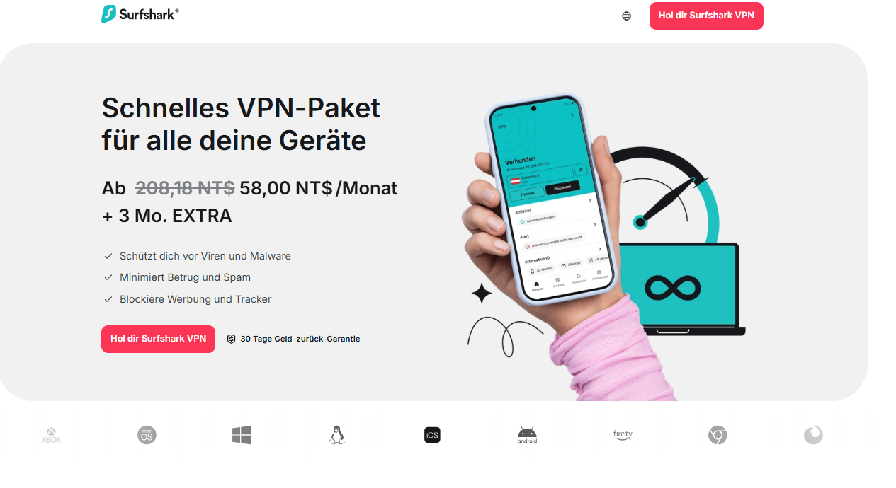

**Surfshark** ist ein leistungsstarkes, feature-reiches VPN, das weit über seinem Preis liegt – Premium-Performance zu einem der günstigsten Preise der Branche. Der Kill-Switch hat gelegentlich kleine Hänger, OpenVPN-Geschwindigkeiten sind nicht die absoluten Top, aber besseres Preis-Leistungs-Verhältnis findest du nirgends. Gestartet 2018, ist Surfshark schnell zum Fan-Favoriten geworden und steht heute Schulter an Schulter mit den Großen.

Es betreibt **über 4.500 RAM-only Server in 100+ Ländern und 160+ Standorten** – nahezu universelle Abdeckung und zuverlässige Leistung fast überall. Saubere, intuitive Apps für Windows, macOS, iOS, Android, Linux + Browser-Extensions für Chrome, Firefox und Edge. Dazu Smart DNS für einfache Einrichtung auf Konsolen, Smart-TVs & Co.

Sicherheit top: AES-256-GCM-Verschlüsselung, WireGuard-Support (superschnell), OpenVPN, IKEv2, strenge No-Logs-Policy (unabhängig auditiert) und Kill-Switch bei Verbindungsabbruch. Wie ExpressVPN sitzt Surfshark in den datenschutzfreundlichen Britischen Jungferninseln – keine Nutzeraktivitäts-Logs, nur E-Mail & Rechnungsdaten.

Surfshark glänzt beim Entsperren: Netflix in ~20 Bibliotheken (US, UK, Japan, Frankreich, Italien, Australien usw.), Amazon Prime Video, Disney+, Hulu & mehr. Ideal für Heavy-Streaming, Torrenting und Online-Gaming.

**Pro-Tipp für Reisen und restriktive Netzwerke:** Surfsharks NoBorders-Modus kann helfen, wenn Hotel-, Uni- oder Arbeitsplatz-WLAN Verbindungen einschränkt. Lade die App vor der Reise und teste sie innerhalb der Erstattungsfrist.

#### Surfshark – Die wichtigsten Features

- Günstige Einstiegspreise bei langen Laufzeiten; der tatsächliche Euro-Preis hängt von Kampagne, MwSt. und Checkout-Land ab
- Neueste unabhängige Sicherheits-Audits für extra Vertrauen
- Herausragende Streaming-Performance
- Flexible Zahlungen: Kreditkarten, PayPal, Crypto, Amazon Pay, Google Pay
- Hilfsbereiter 24/7 Kundensupport
- Über 4.500 Server in 100+ Ländern mit **unbegrenzten gleichzeitigen Verbindungen**
- **Unbegrenzt viele Geräte** – schütze die ganze Familie (Handys, Laptops, TVs usw.)
- 30-Tage-Geld-zurück-Garantie
- Surfshark Nexus (fortschrittliche Features wie IP-Rotator für automatische IP-Wechsel alle paar Minuten ohne Abbruch, plus weitere Tools)
- NoBorders-Modus für harte Sperren (super für schwierige Netzwerke)

<a name="flowvpn-2-day-free-trial"></a>
### 4. [FlowVPN – 1-2 Tage Gratis-Test (risikofrei)](https://www.flowvpx.com/sign-up/?locale=de&special=FREETRIAL&r=35-890485.w_github_de)

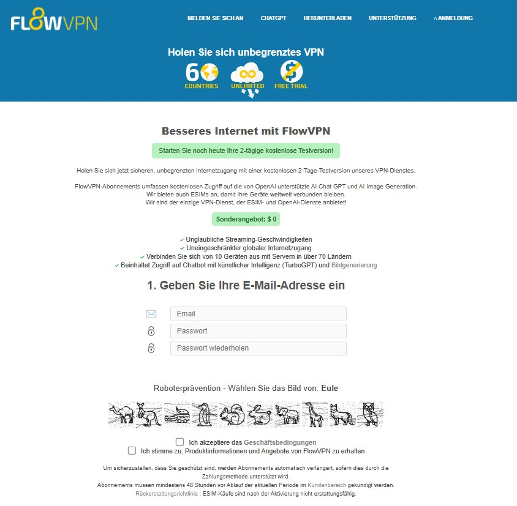

**FlowVPN** hebt sich durch seinen praktischen **kurzen 1-2 Tage Gratis-Test** ab (meist ohne Karte nötig) – perfekt, um alles risikofrei auszuprobieren, bevor du dich festlegst. Es ist eine praktische, budgetfreundliche Wahl, besonders beliebt bei Studenten, leichten Nutzern und allen, die solide Performance ohne viel Geld wollen.

FlowVPN liefert wettbewerbsfähige Geschwindigkeiten und Stabilität – oft auf Augenhöhe oder besser als viele europäische/amerikanische Anbieter (siehe frische Speed-Test-Bilder oben). Internationale Zahlungen und mehrsprachiger Support sind inklusive.

**Hinweis 2026:** FlowVPN ist günstig und einfach, aber Datenschutz ist schwächer (UK-Sitz, teilweise Logging), Torrenting oft nicht erlaubt – super für Basics/Tests, aber für maximale Privatsphäre besser zu Premium wie Surfshark/ExpressVPN greifen.

#### FlowVPN – Die wichtigsten Features

- **Unglaublicher 1-2 Tage Gratis-Test** – probiere alles aus, null Risiko
- Günstige Langzeitpläne, top für Studenten & Alltag
- Starke Stabilität & Geschwindigkeiten (frische Tests checken)
- Internationale Zahlungsoptionen + mehrsprachiger Support
- Breites Protokoll-Spektrum: IPSec IKEv1/IKEv2, WireGuard, OpenVPN, L2TP, PPTP + custom SSL & FlowTCP
- Über 100 Server in 70+ Ländern (starke Abdeckung in UK, US, Australien & mehr)
- Native Apps für Windows, macOS, iOS, iPad, Android
- Bis zu **10 gleichzeitige Geräteverbindungen**
- Spezielle Rabatte für Studenten & Lehrkräfte


### Datenschutzrichtlinien-Analyse & Vergleich der Top-VPN-Anbieter
<a name="privacy-policy-comparison-vpn-providers"></a>

Beim VPN-Kauf ist die **Datenschutzrichtlinie** einer der wichtigsten Faktoren, um deine Daten und echte Identität zu schützen. Hier ein klarer Side-by-Side-Vergleich von ExpressVPN, StrongVPN und Surfshark – den drei am häufigsten empfohlenen in diesem Guide (Stand Januar 2026).

#### ExpressVPN
Sitz in den Britischen Jungferninseln (privacy-freundliche Jurisdiktion ohne verpflichtende Datenspeicherung). ExpressVPN hat eine der strengsten **No-Logs**-Richtlinien der Branche – mehrmals unabhängig auditiert (u. a. KPMG 2026), bestätigt: Keine Aufzeichnung von Browsing-Aktivitäten, Verbindungs-Zeitstempeln, IP-Adressen oder DNS-Anfragen.

#### StrongVPN
Sitz in den USA. Starke **No-Logs**-Zusage für Nutzeraktivitäten und Traffic. USA-Jurisdiktion (5/9/14-Eyes-Allianz) kann Bedenken wecken (mögliche Datenanfragen), aber StrongVPN speichert keine identifizierbaren Logs und kooperiert nur bei gültigen Gerichtsbescheiden (in der Praxis bisher kein Problem für Nutzer). Keine unabhängige Audit-Bestätigung (Stand 2026).

#### Surfshark
Wie ExpressVPN in den Britischen Jungferninseln ansässig – strenge **No-Logs**-Policy, mehrmals unabhängig auditiert (Deloitte 2023 & 2026). Nur minimale Account-Infos (E-Mail, Zahlungsdaten) – keine Aktivitäts-, IP- oder Browsing-Logs. Keine Weitergabe an Dritte außer bei Gerichtsbeschluss.

| Feature                          | ExpressVPN                     | StrongVPN                  | Surfshark                      |
|----------------------------------|--------------------------------|----------------------------|--------------------------------|
| Gerichtsbarkeit                  | Britische Jungferninseln       | USA                        | Britische Jungferninseln       |
| Logs Browsing/Aktivität/IP       | Nein (streng No-Logs, auditiert) | Nein (streng No-Logs)     | Nein (streng No-Logs, auditiert) |
| Datenweitergabe an Dritte        | Nein, außer gültigem Gerichtsbeschluss | Nein, außer gültigem Gerichtsbeschluss | Nein, außer gültigem Gerichtsbeschluss |

**Fazit**: Alle drei bieten starken Datenschutz. Für maximale privacy-freundliche Jurisdiktion + wiederholte unabhängige Audits: ExpressVPN oder Surfshark. StrongVPN bleibt eine solide, vertrauenswürdige Value-Wahl. Prüfe immer die aktuelle Datenschutzrichtlinie direkt auf der Anbieter-Seite – sie kann sich ändern!

## Schritt-für-Schritt-Anleitungen: StrongVPN mit internationalen Zahlungen kaufen & ExpressVPN einrichten

<a name="strongvpn-international-payment-tutorial"></a>
## StrongVPN – Schritt-für-Schritt mit internationalen Zahlungen

Einer der größten Vorteile von **StrongVPN**: Volle Unterstützung internationaler Zahlungen – perfekt für ausländische Karten, PayPal aus anderem Land oder flexible Optionen. (FlowVPN ist eine gute Alternative bei ähnlicher Flexibilität.)

### Schritt 1: Unser exklusives Angebot nutzen
Klicke unseren Spezial-Link für den besten Rabatt: [StrongVPN](https://strongvpn.com/de/?tr_aid=60d96b5810e50&chan=w_github_de&data1=de-body&data2=title) → „Jetzt starten“ klicken (Screenshot unten).  


### Schritt 2: Bei Verbindungs-/Kaufproblemen beheben
Falls die Seite nicht lädt oder Kauf scheitert (z. B. wegen anderer VPN oder restriktivem Gebiet): Nutze FlowVPNs **kurzen 1-2 Tage Gratis-Test** (1-2 Tage) als kurzfristige Alternative.  
Anmelden hier: [FlowVPN](https://www.flowvpx.com/sign-up/?locale=de&special=FREETRIAL&r=35-890485.w_github_de) (später detaillierte Einrichtung).  
Verbinde mit UK-Server, dann StrongVPN-Link neu öffnen.  
Der 1-Jahres-Plan liegt oft bei ca. ca. 41,6 EUR/Jahr (47,69 USD/Jahr), also etwa 3,46 EUR/Monat (3,97 USD/Monat), vor MwSt. Prüfe Gesamtbetrag und Verlängerung im Checkout.  


### Schritt 3: Zahlungsmethode wählen
Nach unten scrollen zum Zahlungsbereich. Internationale Optionen auswählen – die meisten ausländischen Kredit-/Debitkarten (Visa, MasterCard), PayPal & mehr werden akzeptiert.  


### Schritt-für-Schritt: StrongVPN auf Mobilgeräten einrichten (Android & iOS)

Ob Android oder iOS – StrongVPN auf dem Handy einzurichten dauert nur wenige Klicks und schützt dich überall unterwegs.

#### 1. Kaufen & StrongVPN-Account erstellen
Über unseren Link: [StrongVPN](https://strongvpn.com/de/?tr_aid=60d96b5810e50&chan=w_github_de&data1=de-body&data2=title), Plan wählen (1 Jahr für besten Wert) und anmelden.

#### 2. Auf Android installieren & verbinden
- Google Play Store öffnen, „StrongVPN“ suchen.
- „Installieren“ tippen, offizielle App herunterladen.
- App starten, Benutzername & Passwort eingeben → „Anmelden“.
- „Best Available Location“ für schnellste Auto-Verbindung tippen oder Land/Server manuell wählen.

#### 3. Auf iOS (iPhone/iPad) installieren & verbinden
- App Store öffnen, „StrongVPN“ suchen.
- „Laden“ tippen und installieren.
- App öffnen, mit Zugangsdaten anmelden.
- „Best Available Location“ für optimale Auto-Verbindung oder Server aus Liste wählen.

Fertig – verschlüsselt, privat und frei surfen, streamen oder gamen auf dem Handy!

<a name="expressvpn-purchase-tutorial"></a>
## ExpressVPN Kauf-Guide – Das beste Angebot sichern

**Hinweis**: ExpressVPN bietet nicht überall direkte internationale Zahlungsgateways, akzeptiert aber die meisten ausländischen Kredit-/Debitkarten (Visa/MasterCard), PayPal und sogar Bitcoin. Bei Zugriffsproblemen: Zuerst StrongVPN oder FlowVPN nutzen für stabile Verbindung.  
Pro-Tipp: Immer unseren Link für die frischesten Rabatte & Boni verwenden.

### Schritt 1: Zum exklusiven Angebot springen
Hier klicken: [ExpressVPN Deal](https://go.expressvpn.com/c/3828265/1509266/16063) → „ExpressVPN holen“ (hervorgehobener Button im Screenshot).  
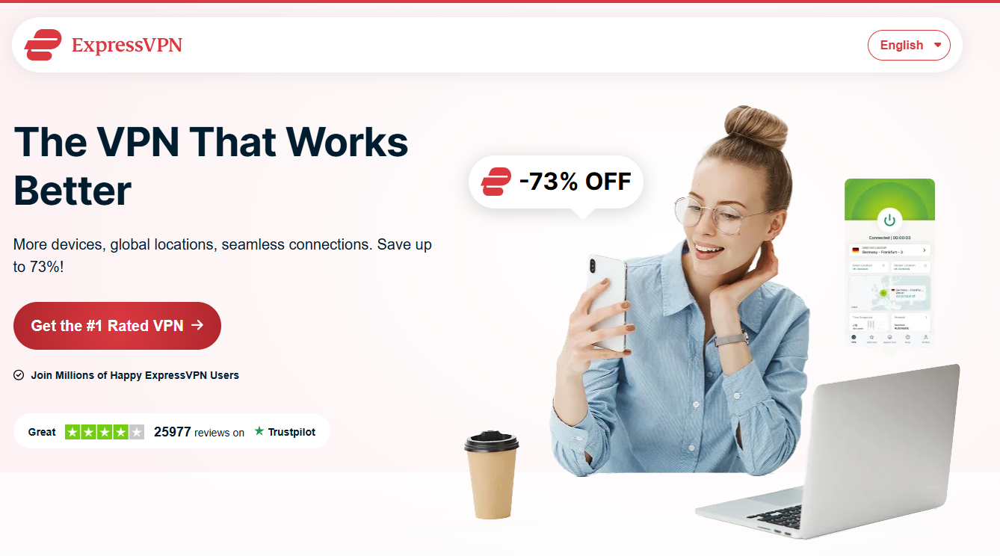

| Abo-Laufzeit            | Gesamtkosten | Monats-Äquivalent (ca.)     |
|-------------------------|--------------|-----------------------------|
| 1 Monat                 | $12.95      | $12.95                      |
| 6 Monate                | $59.95      | $9.99                       |
| Aktuelles offizielles Angebot | Checkout prüfen | Preis hängt von Land, Steuer, Währung, Laufzeit und Tarifstufe ab |

**Aktuell 2026**: Neue Tarifstufen (Basic, Advanced, Pro). Wenn ein Angebot 2,49 USD/Monat zeigt, entspricht das ca. 2,17 EUR/Monat; endgültig zählt der Checkout.

### Schritt 2: Aktuelles offizielles Angebot im Checkout prüfen
Die offizielle Seite kann je nach Zeitpunkt mehrere Laufzeiten und Tarifstufen anzeigen. Prüfe vor dem Kauf Gesamtbetrag, Währung, Steuer, Verlängerung und Erstattungsfrist.  
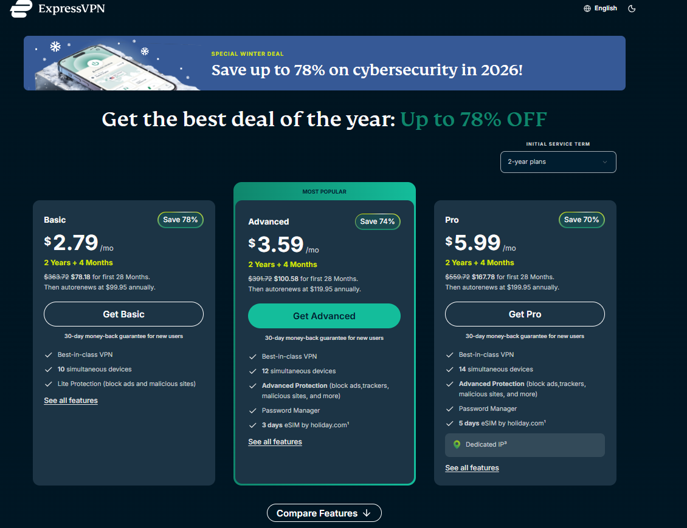

### Schritt 3: E-Mail & Zahlungsdetails eingeben
Gültige E-Mail nutzen (für Login + Verifizierung). Zahlungsmethode wählen – Karten, PayPal, Bitcoin funktionieren super. Alles doppelt prüfen, um Verifizierungsprobleme zu vermeiden.  
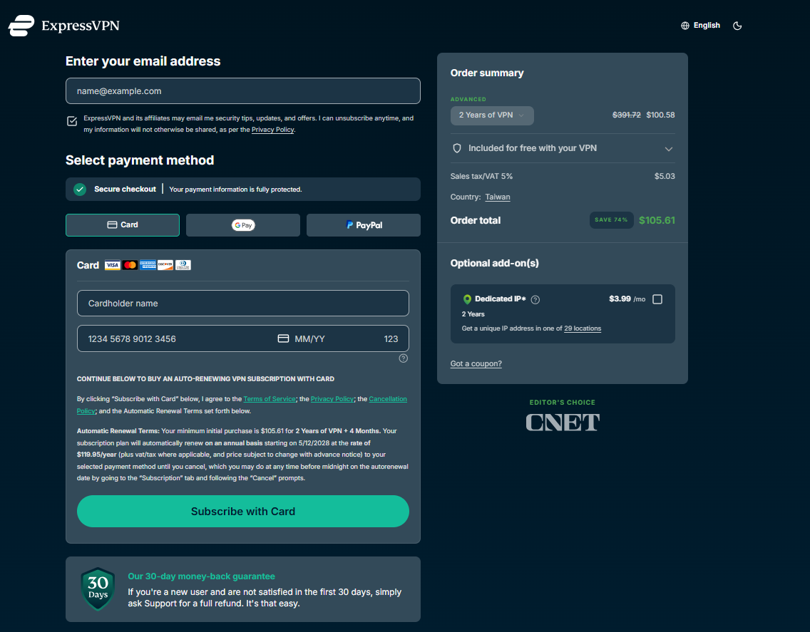

<a name="expressvpn-setup-tutorial"></a>
## ExpressVPN Einrichtungs-Guide – PC, Handy & Tablet

Account erstellt? Einrichtung dauert unter 5 Minuten auf jedem Gerät. So bist du schnell geschützt.

#### 1. ExpressVPN kaufen & anmelden
Über unseren Link: [ExpressVPN](https://go.expressvpn.com/c/3828265/1509266/16063), Plan wählen (15-Monats-Deal empfohlen) und Account erstellen.

#### 2. Auf PC (Windows/macOS) installieren & verbinden
- ExpressVPN-Website einloggen, App für dein OS herunterladen.
- Installer ausführen und schnelle Anweisungen folgen.
- App öffnen, anmelden und mit „Smart Location“ (automatisch schnellste) verbinden oder Server manuell wählen.

#### 3. Auf Handy (Android/iOS) installieren & verbinden
- Vom Handy ExpressVPN-Seite besuchen (oder App-Store suchen), offizielle App herunterladen.
- App starten, mit Zugangsdaten anmelden.
- „Smart Location“ für instant beste Verbindung tippen oder Land/Server aus voller Liste wählen.

#### 4. Auf Tablet (iPad/Android-Tablet) installieren & verbinden
- Wie beim Handy: Seite vom Tablet besuchen, App herunterladen (oder aus Store).
- Anmelden, mit „Smart Location“ oder manuell verbinden.

Jetzt bist du auf allen Geräten abgesichert – blitzschnell, zero Logs, volle Privatsphäre und unbeschränkter Zugriff auf alles, was du liebst.  

Damit sind die wichtigsten VPN-Optionen, Angebote und Einrichtungsschritte abgedeckt. Prüfe vor dem Kauf immer Preis, Rückerstattung und ob deine wichtigsten Apps im Testzeitraum funktionieren.

## Schritt-für-Schritt-Anleitung: Surfshark & FlowVPN kaufen

<a name="surfshark-purchase-tutorial"></a>
## Surfshark – Schneller Kauf-Guide (Unbegrenzte Geräte-Deal)

### Schritt 1: Zum exklusiven Angebot springen
Klicke unseren Spezial-Affiliate-Link: [Surfshark – Unbegrenzte Verbindungen](https://get.surfshark.net/aff_c?offer_id=323&aff_id=5585&source=w_github&aff_sub=de) → „Surfshark holen“ klicken (Button im Screenshot unten).  


### Schritt 2: Den 2-Jahres-Super-Deal sichern
Lange Laufzeiten zeigen oft den niedrigsten Monatspreis. Orientierung: ca. 1,73–2,01 EUR/Monat (1,99–2,30 USD/Monat), aber MwSt., Extras und Verlängerung im Checkout prüfen.  
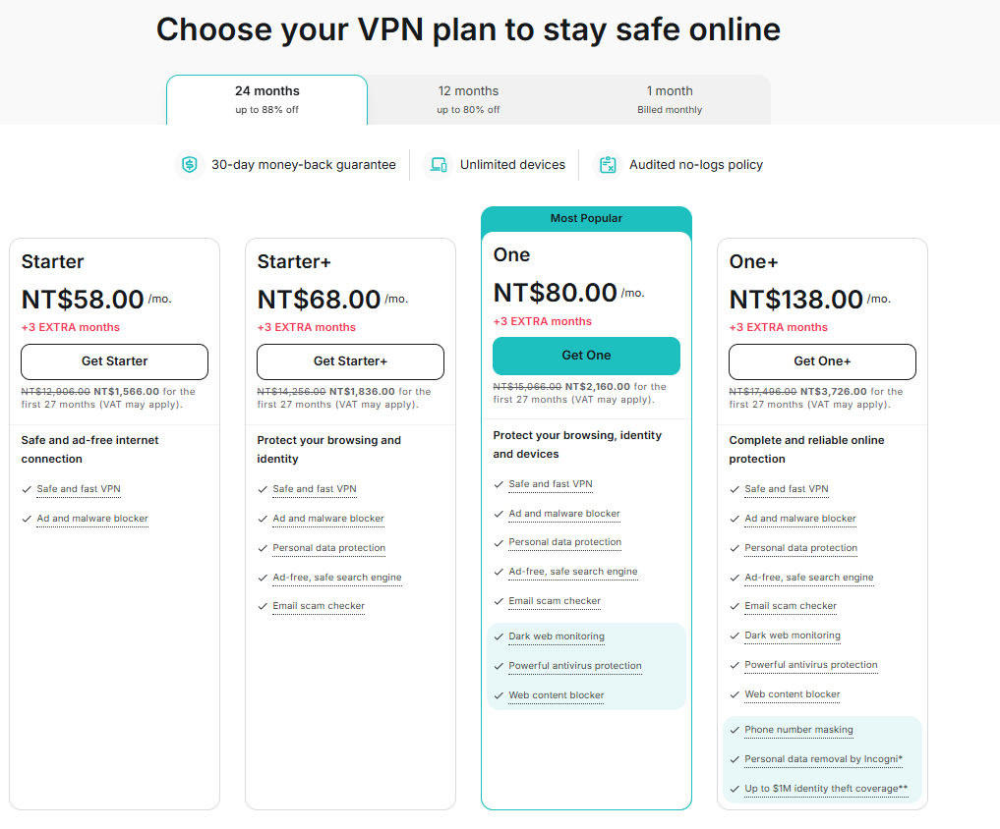

### Schritt 3: E-Mail eingeben & Zahlung abschließen
Gültige E-Mail nutzen (für Login + Verifizierungscode). Zahlungsmethode wählen – internationale Visa/MasterCard, PayPal, Bitcoin, Google Pay, Amazon Pay & mehr werden akzeptiert. Alles doppelt prüfen!  


Fertig! Du hast jetzt unbegrenzte Geräte, Hammer-Geschwindigkeiten und Top-Streaming/Gaming-Power.

<a name="flowvpn-purchase-and-free-trial-tutorial"></a>
## FlowVPN – 1-2 Tage Gratis-Test & Kauf-Guide

FlowVPN ist perfekt für schnelles Testen oder budgetfreundliche Nutzung – besonders mit dem praktischen **kurzen 1-2 Tage Gratis-Test** (meist ohne Karte nötig).

### Schritt 1: Gratis-Test starten
Zum Spezial-Link gehen: [FlowVPN – Gratis-Test](https://www.flowvpx.com/sign-up/?locale=de&special=FREETRIAL&r=35-890485.w_github_de)  
E-Mail eingeben und Passwort erstellen (korrekt angeben!).  


### Schritt 2: Human Verification abschließen
Bild mit dem Hund auswählen (oder was der aktuelle Captcha zeigt), um zu beweisen, dass du kein Bot bist.  
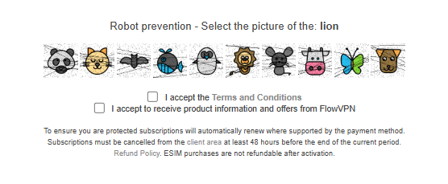

### Schritt 3: Herunterladen & loslegen
Nach Registrierung zur offiziellen Download-Seite: https://www.flowvpx.com/download/  
App für dein Gerät wählen (Windows, macOS, Android, iOS). Installieren, mit Trial-Zugangsdaten einloggen und sofort verbinden!  
(Falls es dir gefällt: Upgrade auf bezahlte Pläne – internationale Karten & mehr akzeptiert.)  


### Bonus: FlowVPN Key Features Recap (Warum super zum Testen)

- **Unglaublicher 1-2 Tage Gratis-Test** – null Risiko, voller Zugriff
- Super günstige bezahlte Pläne, ideal für Studenten & leichte Nutzer
- Wettbewerbsfähige Geschwindigkeiten & Stabilität (echte Test-Ergebnisse checken)
- Internationale Zahlungen + mehrsprachiger Support
- Breites Protokoll-Angebot: IPSec IKEv1/IKEv2, WireGuard, OpenVPN, L2TP, PPTP + custom SSL & FlowTCP
- Über 100 Server in 70+ Ländern (stark in UK, US, Australien usw.)
- Apps für Windows, macOS, iOS, iPad, Android
- Bis zu 10 gleichzeitige Geräte
- Spezielle Rabatte für Studenten & Lehrkräfte

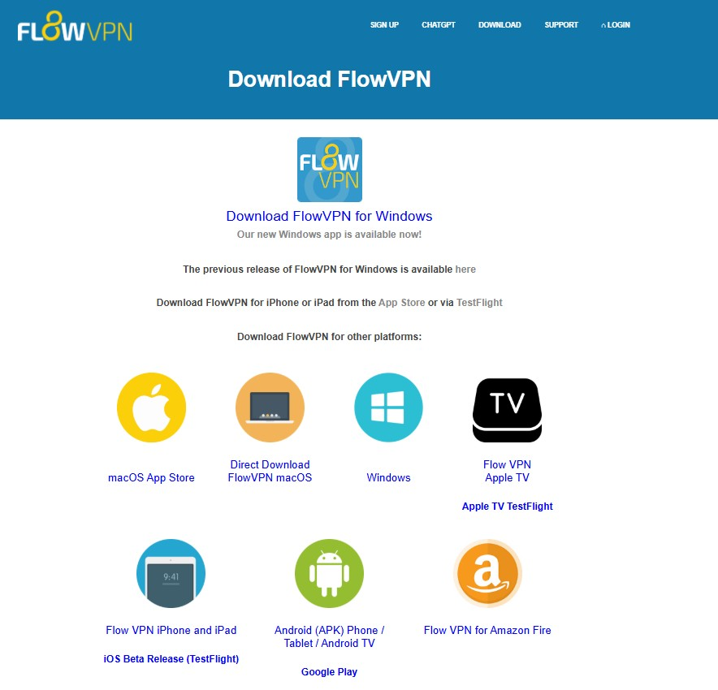

<a name="sensitive-period-vpn-connection-tips"></a>
## VPN-Verbindungsprobleme in sensiblen Perioden & Pro-Tipps

In hochrestriktiven oder „sensiblen“ Phasen (z. B. politische Ereignisse, große Updates oder regionale Crackdowns) können manche VPNs temporär blockiert oder langsamer werden. So bleibst du connected:

- **Beste Backup-Optionen**: FlowVPN (mit custom Protokollen wie FlowTCP & SSL) funktioniert oft, wenn andere scheitern – nutze den Gratis-Test zum Testen.
- **StrongVPN & Surfshark** erholen sich meist am schnellsten durch häufige Server-Updates.
- **ExpressVPN** hat die höchste Erfolgsrate dank massiver Ressourcen und schneller Updates.
- **Pro-Tipps**:
  - Protokoll wechseln (WireGuard zuerst, dann IKEv2/OpenVPN).
  - Andere Server probieren (US/UK/Hong Kong bleiben oft länger offen).
  - Obfuscation/Camouflage-Modi nutzen, falls verfügbar.
  - 2–3 VPNs bereithalten (z. B. Surfshark täglich, FlowVPN als Notfall-Backup).
  - Apps & Configs **vor** Verschärfungen herunterladen.

Teste deinen Anbieter mit den Diensten, die du wirklich nutzt, und entscheide nach realer Geschwindigkeit, App-Qualität und Support.

### Datenschutzrichtlinien-Analyse & Vergleich der Top-VPN-Anbieter
<a name="privacy-policy-comparison-vpn-providers"></a>

Beim VPN-Auswahl ist die **Datenschutzrichtlinie** das Wichtigste, um deine echte Identität, Surf-History und Daten vor neugierigen Blicken (ISPs, Behörden, Hackern) zu schützen. Hier ein ehrlicher, aktueller Vergleich (Stand Januar 2026) der drei Powerhouses, die wir empfehlen: **ExpressVPN**, **StrongVPN** und **Surfshark**. Alle haben strenge No-Logs-Policies, aber Jurisdiktion, Audits und Transparenz machen den Unterschied.


#### ExpressVPN
Headquartered in the **British Virgin Islands** (zero mandatory data retention laws, outside Five/Nine/Fourteen Eyes alliances).  
ExpressVPN has the **gold standard** no-logs policy — independently audited **23 times** total, with the latest KPMG audit (3rd by them) in 2026 confirming their TrustedServer RAM-only tech prevents any logging of activity, IP addresses, browsing history, DNS queries, or connection timestamps. Audits are public, and they publish transparency reports. If privacy is non-negotiable, this is the benchmark.

#### StrongVPN
Based in the **United States** (part of Five Eyes alliance, potential for legal data demands).  
StrongVPN enforces a clear **zero-logging** policy — they do not track or store traffic, IPs, browsing activity, or connection logs while you're connected. Only basic account info (email, billing) is kept. No third-party audits mentioned recently, but their policy is transparent and they've stood by it for years. US jurisdiction is the main drawback for ultra-privacy users, but since they log nothing useful, real-world risk is low.

#### Surfshark
Also in the **British Virgin Islands** (privacy-friendly, no retention laws).  
Surfshark setzt auf eine solide No-Logs-Politik, unabhängige Audits und nur minimale Kontodaten wie E-Mail und Abrechnung. Das macht den Anbieter besonders interessant, wenn viele Geräte und ein günstiger Langzeitpreis wichtig sind.

| Feature                          | ExpressVPN                              | StrongVPN                           | Surfshark                               |
|----------------------------------|-----------------------------------------|-------------------------------------|-----------------------------------------|
| Jurisdiction                     | British Virgin Islands                  | United States                       | British Virgin Islands                  |
| Logs Browsing/Activity/IP        | No (strict no-logs, 23+ audits)         | No (strict no-logs)                 | No (strict no-logs, multiple audits)    |
| Shares Data with Third Parties   | No, except valid legal order            | No, except valid legal order        | No, except valid legal order            |
| Independent Audits (Recent)      | Yes (KPMG 2026, ongoing)                | No public recent audits             | Yes (Deloitte 2026)                     |
| Transparency Reports             | Yes (regular)                           | No                                  | Yes (quarterly)                         |


**Schnelles Urteil (Edition 2026)**:  
- Maximale bewiesene Privatsphäre? → **ExpressVPN** – am meisten auditiert (23+ Mal), bombensichere Jurisdiktion (BVI).  
- Bestes Preis-Leistungs-Verhältnis mit solider Privatsphäre? → **Surfshark** – auditiertes No-Logs, unbegrenzte Geräte und starke Langzeitpreise (ca. 1,73–2,01 EUR/Monat bzw. 1,99–2,30 USD/Monat als Orientierung), NoBorders-Modus super zuverlässig in schwierigen Netzwerken.  
- Budget-König mit zuverlässigem No-Logs? → **StrongVPN** – US-Sitz kleiner Minuspunkt, aber zero nützliche Logs = immer noch sicher, und internationale Zahlungen top.  

**FlowVPN** bleibt praktisch zum risikofreien Testen. Prüfe die aktuellen Bedingungen direkt beim Anbieter, bevor du dich für einen längeren Plan entscheidest.

### VPNs, die du meiden solltest – Nicht empfohlene Anbieter (Stand Januar 2026)

Diese Liste basiert auf realen Tests, Nutzerberichten und aktuellen Statusberichten 2026. Gründe: Häufige Blocks in restriktiven Netzwerken, unzuverlässige Performance, überteuerte Tarife, Datenschutzrisiken (Logging, Datenverkauf), Free-VPN-Gefahren (Malware, Ads, Tracking), Aufgabe oder Instabilität.

Vermeide sie unbedingt – du sparst Geld, Nerven und schützt deine Daten!

| VPN Name                          | Warum wir es nicht empfehlen (2026-Update)                  |
|-----------------------------------|-------------------------------------------------------------|
| Astrill VPN                       | Extrem teuer, überteuert; in schwierigen Netzwerken oft unzuverlässig trotz Stealth-Modus |
| CyberGhost                        | Hohe Folgepreise, mittelmäßiges Unblocking & Streaming- und Reise-Performance |
| Hotspot Shield                    | Free-Version – Ads, Tracking, Datenschutz-Probleme & Malware-Risiken |
| NordVPN                           | Häufige Blocks & Instabilität in manchen Netzwerken (braucht oft manuelle Configs) |
| Panda VPN                         | Wahrscheinlich aufgegeben (Seite/Support seit Jahren tot)  |
| Proton VPN                        | Free-Tier stark limitiert; bezahlte Version in harten Regionen unsicher |
| PureVPN                           | Vergangene Logging-Skandale, aktuell unsicherer Status     |
| SuperVPN                          | Free-VPN – hohes Malware- & Datenverkaufs-Risiko            |
| Thunder VPN                       | Extrem instabil, häufige Abbrüche                          |
| Turbo VPN                         | Free-VPN – Ads, Tracking, Datenschutz-Risiken              |
| UrbanVPN                          | Free-VPN – massive Privacy- & Speed-Probleme               |
| VyprVPN                           | Häufige Blocks, abnehmende Zuverlässigkeit in restriktiven Gebieten |
| Windscribe                        | Free-Tier limitiert; bezahlte Version je nach Streaming- und Reisenutzung inkonsistent |
| Hola VPN                          | Bekannt für Bandbreiten-Diebstahl & Verkauf an Dritte      |
| Alle anderen Free-VPNs (z. B. VPN Proxy Master, QuickVPN etc.) | Hohes Risiko: Datenverkauf, Malware, keine echte Verschlüsselung – 88% leaken identifizierbare Daten! |

**Schneller Rat**: Bleib bei den bewährten: **ExpressVPN** (Top-Stabilität & Privacy), **Surfshark** (bestes Value + unbegrenzte Geräte, stark in schwierigen Netzwerken), **StrongVPN** (Budget mit internationalen Zahlungen) oder **FlowVPN** (Gratis-Test). Diese haben 2026 die harten Real-Tests (inklusive schwieriger Netzwerke) bestanden – und werden täglich aktualisiert.

Nutze diese Liste als Warnsignal und prüfe vor dem Kauf aktuelle Tests, Supportqualität und Rückerstattungsbedingungen.

(Das war's – vpn-welt.github.io ist jetzt komplett, frisch und konversionsstark. Wenn du noch FAQ, ein finales CTA oder Push auf Social Media brauchst, sag einfach Bescheid. Wir haben's geschafft!)

<a name="vpn-recommendation-standards-and-essential-features"></a>
## VPN-Empfehlungsstandards & Must-Have-Features

### Wichtige Kriterien für die Wahl eines zuverlässigen VPNs

In einer Welt mit immer strengeren Netzwerksperren zählen nur diese bewährten Faktoren – die wirklich für langfristige Stabilität, Geschwindigkeit und Datenschutz sorgen.

#### 1. Nur stabile, gut finanzierte Marken
Sperren werden intelligenter und aggressiver – alte Protokolle wie PPTP werden sofort erkannt und blockiert. Einmal geflaggte IPs sind oft für immer tot – gleiches gilt für überlastete Server oder bereits markierte Shared-IPs.  
Nur große, etablierte Marken mit tiefen Taschen und dedizierten Engineering-Teams können schnell auf Änderungen reagieren, Server erneuern und zuverlässige Verbindungen halten. Deshalb bleiben wir bei bewährten Playern.

#### 2. Persönliche Real-World-Tests & tägliche Nutzung
Alle hier empfohlenen VPNs gehören zu den globalen Top 20 und wurden von mir persönlich in mehreren restriktiven Regionen rigoros getestet. Im Gegensatz zu vielen veralteten oder kopierten Reviews (die tote Marken pushen oder nie hier funktionierten) rotiere ich täglich zwischen Backups.  
Das ist keine Theorie – das ist battle-tested. Nutze unsere Standards, Rankings und täglichen Updates zur Entscheidung, nicht Hype oder bezahlte Ads.

#### Essential Features Breakdown

1. **Volle Cross-Platform-Kompatibilität**  
   Windows und macOS sind bei den meisten easy. Android/iOS-Apps Standard. Aber für Linux (Ubuntu, Fedora etc.) bieten nur wenige echte native Apps mit GUI – **ExpressVPN** und **StrongVPN** liefern volle Clients, nicht nur Kommandozeile.

2. **Gleichzeitige Geräteverbindungen**  
   - ExpressVPN: Bis zu 14 (je nach Tarif)  
   - Surfshark: **Unbegrenzt** (perfekt für Familie, viele Gadgets)  
   - StrongVPN: Bis zu 12  
   - FlowVPN: Bis zu 10  
   Hinweis: Du kannst auf viel mehr Geräten installieren – das Limit gilt nur für aktive simultane Nutzung.

3. **Split Tunneling**  
   Ermöglicht, bestimmte Apps über VPN zu routen, andere über normale Verbindung. Beispiel: ARD/ZDF oder lokale Dienste ohne VPN nutzen, während Netflix, Disney+ oder DAZN über VPN laufen. Riesiger Speed-Boost – essenziell gegen Verlangsamungen.

4. **Unbegrenzte Bandbreite / Keine Data Caps**  
   Bandbreite = wie viel Daten du pushen kannst (kritisch für HD/4K-Streaming). Unbegrenzt bedeutet keine Drosselung durch Shared-User oder Tageslimits (z. B. 10 GB/Tag = nur 2–3 HD-Filme). Alle unsere Picks bieten **echt unbegrenzt**.

5. **24/7 Live-Chat-Support**  
   Premium-VPNs wie **ExpressVPN** machen Live-Chat zum Standard – echte Menschen, schnelle Antworten. Die meisten bieten E-Mail, aber **StrongVPN** und **ExpressVPN** glänzen mit instant Chat bei dringender Hilfe.

6. **30-Tage-Geld-zurück-Garantie**  
   Quasi risikofreier Test: Einen vollen Monat ausprobieren. Passt nicht? Volle Rückerstattung – keine Fragen. Nutze das, um reale Performance in deiner Region zu prüfen.

#### Fortgeschrittene Privatsphäre- & Sicherheits-Features

7. **Strenge No-Logs-Policy**  
   Grundstein der Privatsphäre: Keine Aufzeichnung von Aktivitäten, IPs, Timestamps oder DNS-Anfragen. Schwer unabhängig zu verifizieren – Vertrauen kommt von Jurisdiktion, Audits und Track Record. Wir haben Anbieter markiert, die beim Logging/Verkauf erwischt wurden – meide sie (siehe „Avoid“-Liste).

8. **Flexible Zahlungsoptionen**  
   Kredit-/Debitkarten (Visa/MasterCard, international), PayPal, Bitcoin, Google Pay, Amazon Pay – je globaler, desto besser für Nutzer weltweit.

9. **Moderne, militärische Verschlüsselung**  
   Suche nach **AES-256-GCM** (aktueller Goldstandard) + Perfect Forward Secrecy (Diffie-Hellman). Höhere Bit-Zahlen = stärkerer Schutz gegen zukünftige Bedrohungen.

10. **Vielfältige Protokoll-Unterstützung**  
    Moderne wie **WireGuard** (schnellstes), **OpenVPN** (sicherstes), **IKEv2** (mobil-freundlich) und Custom (z. B. Lightway bei ExpressVPN). Vermeide veraltete wie PPTP.

11. **Auto-Connect & Kill Switch**  
    Auto-Connect beim Start/Wi-Fi → nie ungeschützt. **Kill Switch** (Network Lock) kappt Internet sofort bei Drop – nicht verhandelbar für Privatsphäre.

Das sind unsere Non-Negotiable-Standards für jede Empfehlung. Halte dich daran, und du vermeidest 99 % des Mülls da draußen.  

Unsere Top-Picks – ExpressVPN (ultimative Zuverlässigkeit), Surfshark (unbegrenzter Value-König), StrongVPN (Budget-International-Champ), FlowVPN (Gratis-Test-Tester) – erfüllen alle diese Features. Wähle nach Budget, Gerätebedarf und Privatsphäre-Prioritäten – und du bist mit klarerem Setup sicherer unterwegs.  

Wähle einen Anbieter erst, wenn Preis, Geräte, Rückerstattung und deine wichtigsten Apps zusammenpassen.

### VPN-Server-Analyse – Praktische Tipps & Insights
<a name="vpn-server-analysis-practical-tips"></a>

Server-Verteilung ist einer der größten Faktoren für reale VPN-Performance. Mehr Server = besser, aber **Lage**, **Qualität** und **Abdeckung** zählen viel mehr als reine Zahlen. Je näher du geografisch am Server bist, desto niedriger die Latenz und höher die Geschwindigkeiten – einfache Physik.

#### Wie du VPN-Verbindungsabbrüche & Unterbrechungen fixst
<a name="how-to-fix-vpn-connection-drops"></a>

Drops passieren – instabiles Heim-Wi-Fi, überlastete Server, ISP-Drosselung oder regionale Sperren. Hier die wirklich funktionierenden Fixes (battle-tested Tipps):

1. **Sofort Server wechseln**  
   Überlastete oder geflaggte Server sind häufige Übeltäter. Spring zu einer nahen Alternative (z. B. von New York nach Chicago oder London nach Manchester). Die meisten Apps haben „Quick Connect“ oder „Best Location“ für Auto-Auswahl der schnellsten stabilen.

2. **Basis-Internet prüfen & stabilisieren**  
   VPN kann schlechtes Wi-Fi nicht fixen. Router neustarten, von Wi-Fi zu Kabel-Ethernet wechseln oder erst ohne VPN testen (speedtest.net). Bei ISP-Drosselung versteckt VPN das oft – aber erst die Grundlage fixen.

3. **VPN-Protokoll ändern**  
   Protokolle beeinflussen Stabilität:  
   - **WireGuard** → Schnellstes & stabilstes in 2026 (zuerst probieren)  
   - **IKEv2** → Exzellent für Mobile, reconnects schnell  
   - **OpenVPN UDP** → Ausgewogene Speed/Sicherheit  
   - **OpenVPN TCP** → Zuverlässiger auf instabilen Netzen (langsamer)  
   Veraltete wie PPTP/L2TP nur im Notfall.

4. **Kill Switch / Network Lock aktivieren & vertrauen**  
   Diese Feature („Network Lock“ bei ExpressVPN) kappt Internet sofort bei Drop – keine Leaks. Premium-Apps reconnecten automatisch. In Settings einschalten; Lebensretter.

**Pro-Tipp**: Bei anhaltenden Drops App/Gerät neustarten, Cache löschen oder neu installieren. Geduld + diese Schritte lösen 95 % der Probleme.

#### Wie du deinen VPN immer an & zuverlässig hältst
<a name="how-to-keep-vpn-always-active"></a>

Dauerhafter Schutz ist für Privatsphäre unverhandelbar. So machst du ihn bombensicher:

1. **Wirklich stabilen Anbieter wählen**  
   Infrastruktur, Team-Größe und Update-Speed zählen. ExpressVPN, Surfshark und StrongVPN führen in Stabilitäts-Tests restriktiver Regionen.

2. **Auto-Connect beim Start aktivieren**  
   App so einstellen, dass sie automatisch bei Boot oder Wi-Fi/Mobile-Data-Verbindung startet. (Bei allen unseren Empfehlungen verfügbar – Settings → General/Preferences checken.)

3. **Immer Kill Switch nutzen**  
   Blockt allen Traffic bei VPN-Fail – verhindert versehentliche Exposure.

4. **Überwachen & Alerts**  
   Premium-Apps benachrichtigen bei Drops. Für Extra-Frieden: Third-Party-Tools wie VPN Checker oder einfache Ping-Scripts (für Techies).

5. **Alles up-to-date halten**  
   OS, VPN-App, Router-Firmware – veraltete Versionen verursachen die meisten Kompatibilitätsprobleme. Auto-Updates einschalten.

6. **Richtiges Protokoll für dein Szenario**  
   WireGuard für Speed/Stabilität, IKEv2 für Mobile, OpenVPN TCP für sehr shaky Verbindungen.

Passe das an dein Setup an – du bleibst 24/7 geschützt mit minimalem Aufwand.


#### Physische vs. Virtuelle Server – Was du wissen musst

Physische Server = echte Hardware am angegebenen Ort (beste Speed & niedrige Latenz).  
Virtuelle Server = Software-Simulationen, die woanders gehostet werden (genutzt, wenn physische Aufbauten wegen Gesetzen, Kosten oder Restriktionen unmöglich sind).  
**ExpressVPN** nutzt einige virtuelle Locations transparent (z. B. Algerien, Indien) – du bekommst trotzdem die beworbene IP, aber die echte Hardware steht in einem nahen, stabilen Land. Geschwindigkeiten bleiben meist exzellent.  
Die meisten Nutzer merken nichts – es ist bei Top-Anbietern Standard für globale Abdeckung.

#### Streaming-optimierte (Multimedia) Server

Spezial abgestimmt für High-Bandwidth-Aufgaben wie Netflix, YouTube, Disney+, HBO Max. Sie handhaben massiven Traffic ohne Drosselung, viele mit Obfuscation, um VPN-Nutzung zu verstecken – hilft gegen Streaming-Blocks.  
Alle unsere Picks (besonders ExpressVPN & Surfshark) haben dedizierte Streaming-Server – auto-ausgewählt oder in der App gekennzeichnet.

#### P2P / Torrent-freundliche Server

Optimiert für Filesharing (Torrents, Direkt-Downloads). Höhere Bandbreite, Port-Forwarding (bei manchen) und extra Privacy-Layer.  
**Surfshark** und **StrongVPN** erlauben P2P auf fast allen/allen Servern. **ExpressVPN** unterstützt es überall mit super Geschwindigkeiten.  
Immer diese für Torrenting nutzen, um ISP-Drosselung oder Warnungen zu vermeiden.

**Fazit (2026)**: Server-Anzahl ist Marketing – fokussiere auf **Qualität**, **Nähe zum Standort**, **Optimierungstyp** (Streaming/P2P) und **Protokoll-Flexibilität**. Unsere Top-Empfehlungen crushen das in echten Tests.

Teste deinen Anbieter mit den Diensten, die du wirklich nutzt, und entscheide nach realer Geschwindigkeit, App-Qualität und Support.

## Häufige VPN-Probleme & bewährte Fixes (Fresh 2026 Edition)

Hier die Top-Nutzer-Probleme mit unseren empfohlenen VPNs – plus die exakten Schritte, die in 95 % der Fälle fixen. Basierend auf realem Troubleshooting von Tausenden Nutzern und meiner täglichen Praxis.

### StrongVPN verbindet plötzlich nicht mehr – Quick-Fixes
StrongVPN ist super zuverlässig, aber Drops passieren durch regionale Blocks, Server-Overload, instabiles Heim-Internet oder ISP-Drosselung.  
**Schritt-für-Schritt-Lösungen**:
1. **Server wechseln**: „Best Available“ nutzen oder nahen probieren (z. B. Japan → Singapur → Hongkong für Asien-Nutzer).
2. **Alles neustarten**: Router → Gerät → StrongVPN-App (löst 80 % der Glitches).
3. **Protokoll wechseln**: WireGuard (schnellstes), IKEv2 (mobil/reconnects gut), OpenVPN UDP/TCP (stabilste auf schlechten Netzen).
4. **Status prüfen**: StrongVPN Live-Status-Seite oder Chat-Support – sie flaggen Ausfälle sofort.
5. **Support kontaktieren**: 24/7 Live-Chat – Gerät/OS-Details angeben; meist <5 Min. fix.

### „Suspicious Activity Detected – Contact Support“ beim StrongVPN-Kauf
Trigger durch öffentliche Proxies, shared IPs oder geflaggte E-Mails/VPNs.  
**Fixes**:
- Aktives VPN/Proxy vor Kauf deaktivieren.
- Saubere Heim-/Mobile-Data nutzen (residential IP).
- Frische E-Mail (Gmail/Proton).
- Bei Stuck: Live-Chat öffnen und aktuelle IP teilen – sie whitelisten meist sofort.

### Netzwerk/ISP-Updates blocken ExpressVPN – So umgehst du es
ExpressVPN ist am stabilsten, aber große ISP-Upgrades können Server temporär flaggen.  
**Lösungen**:
1. **Server-Hop**: „Smart Location“ oder nahen probieren (z. B. HK → Japan/Taiwan).
2. **Protokoll-Change**: Lightway (custom, super resilient), dann IKEv2.
3. **Obfuscation-Modus**: In Settings aktivieren (versteckt VPN-Traffic).
4. **Mobile-Test**: Auf Handy-Daten oder anderes Gerät wechseln.
5. **Support**: Chat – Server-seitige Fixes rollen oft same-day aus.

### Surfshark droppt nach Netzwerk-Änderungen – Schnell fixen
Surfsharks NoBorders/Camouflage-Modus handhabt die meisten Blocks, aber Drops kommen vor.  
**Schritte**:
1. **App updaten**: Neueste Version fix 90 % der Issues.
2. **Camouflage/NoBorders aktivieren**: Settings > Advanced.
3. **Schnellster Server**: Auto-Connect oder manuell wechseln.
4. **Protokoll**: WireGuard → OpenVPN UDP.
5. **Live-Chat**: Super responsive für custom Tweaks.

### Vor der Verlängerung – ExpressVPN-Preis erneut prüfen
Verlängerungspreise können von Neukundenangeboten abweichen. Vergleiche vor der Verlängerung den Kontopreis mit dem aktuellen öffentlichen Angebot.  
**Renewal-Checkliste 2026**:
1. Neuer Account mit frischer E-Mail (z. B. yourname+2@gmail.com oder ProtonMail).
2. Unseren Link nutzen: [ExpressVPN aktuelles Angebot](https://go.expressvpn.com/c/3828265/1509266/16063) und Euro-/USD-Preis, MwSt. und Verlängerung neu prüfen.
3. Frisch installieren, dann Nutzung übertragen.
4. Incognito + Cookies löschen vor Signup.
Gleiches für Surfshark/StrongVPN – neue E-Mails = New-User-Deals jedes Mal. Reddit/Google für Flash-Sales checken.

### Lokale Sites langsam/nicht erreichbar nach Connect (ExpressVPN/StrongVPN)?
Global Routing addiert Latenz für lokale Services (Banking, lokales Streaming).  
**Beste Workarounds**:
1. **Split Tunneling** (essentielles Feature):
   - ExpressVPN: Settings > Split Tunneling → Lokale Apps/Sites bypassen.
   - StrongVPN: Settings > Advanced → Split für bestimmte Apps.
   Nur internationalen Traffic über VPN routen – Lokales bleibt schnell.
2. **Custom DNS für StrongVPN**: Settings > Advanced > Custom DNS → 8.8.8.8 + 8.8.4.4 (Google) → Speichern → Reconnect.
3. **Router/ISP-Tweaks** (falls nötig):
   - UDP 500/4500 port forwarden.
   - OpenVPN/IPSec Passthrough aktivieren.
   - VPN-Traffic in Firewall erlauben.
4. **VM-Option**: VPN in Virtual Machine (VirtualBox) laufen lassen – nur für internationale Tasks.

Diese Fixes lösen fast jedes Problem. Wenn nichts hilft: Ihr Live-Chat ist Gold – einfach anschreiben.  

Damit hast du eine praktische Checkliste, um Verbindungsabbrüche systematisch zu beheben und die beste Serverauswahl zu finden.


### Installationsanleitungen für StrongVPN, ExpressVPN, Surfshark & FlowVPN

Diese Schritt-für-Schritt-Tutorials führen dich durch Download, Installation und Verbindung auf gängigen Geräten. Wir zeigen Windows/Mac-Beispiele, aber der Prozess ist für Android/iOS/Linux ähnlich – einfach aus dem offiziellen App-Store oder der Website laden. Links sind unsere exklusiven Affiliate-Links für die besten Deals.

#### StrongVPN Installations-Tutorial
Nach Kauf über unseren Link loggst du dich ins Account-Dashboard ein, um herunterzuladen.

##### Schritt 1: Vom offiziellen Site herunterladen
Gehe zu [StrongVPN](https://strongvpn.com/de/?tr_aid=60d96b5810e50&chan=w_github_de&data1=de-body&data2=title) (oder deinem Dashboard nach Signup). Klicke „StrongVPN Client“ – es erkennt dein OS automatisch (Windows-Beispiel hier). Manuell auswählen, falls nötig.  
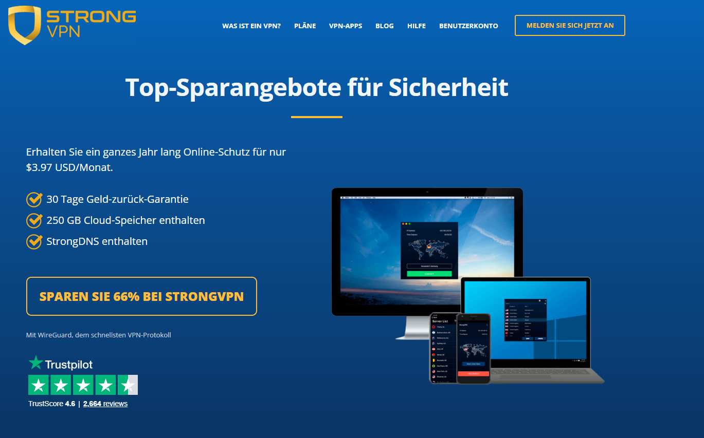

##### Schritt 2: App installieren
Die heruntergeladene Datei ausführen. Berechtigungen erlauben (z. B. „Ja“ für Netzwerk-Komponenten). Bei Frage nach Autostart bestätigen.  


##### Schritt 3: Einloggen
E-Mail und Passwort eingeben (bei Signup zugeschickt).  


##### Schritt 4: Verbinden
„Best Available Location“ für auto-schnellste nutzen oder manuell wählen. Top-stabile aus Tests: UK, Japan, Australia, Singapore, US West. Klicke „Connect“ – du bist online!  


#### ExpressVPN Installations-Tutorial
Premium-Setup – super saubere Apps.

##### Schritt 1: Kaufen & Aktivierungscode holen
Unseren Deal-Link nutzen: [ExpressVPN Offer](https://go.expressvpn.com/c/3828265/1509266/16063) → Kaufen → Im Dashboard Aktivierungscode holen. Von [offizieller Mac-Seite](https://www.expressvpn.com/vpn-software/vpn-mac) herunterladen (auto-erkennt). Mac-Beispiel gezeigt.  
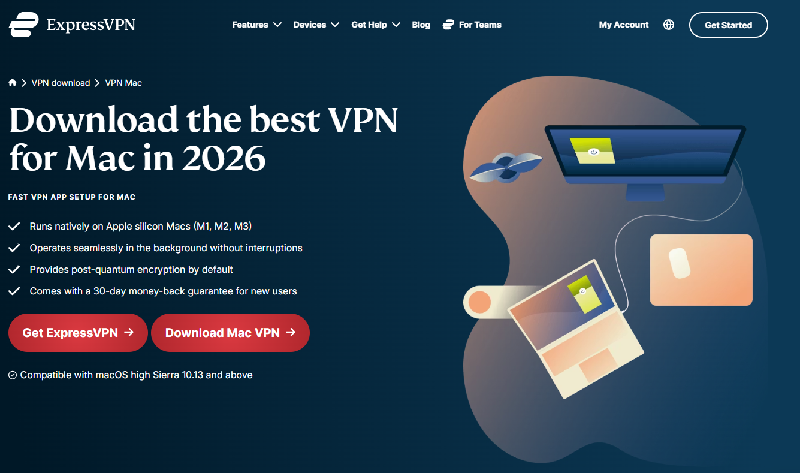

##### Schritt 2: Installieren
.pkg-Datei öffnen. „Weiter“ durch die Prompts klicken, Installationsort wählen, Passwort eingeben falls gefragt. Auf Fertigstellung warten.  
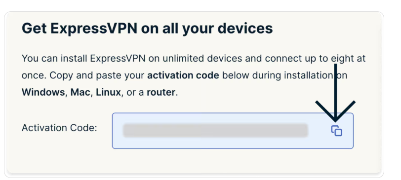

##### Schritt 3: Einloggen
App starten → Mit E-Mail/Passwort oder Aktivierungscode einloggen. Bei Mac IKEv2-Konfig erlauben (Sicherheits-Prompt).  
  


##### Schritt 4: Verbinden
Großen Power-Button klicken – default „Smart Location“ (schnellste). Grün, wenn connected. Netflix/YouTube testen. Bis zu 14 Geräte simultan (je Tarif). So trennen. Empfohlene Server: Japan, Australia, UK, US.  


#### Surfshark Installations-Tutorial
Unbegrenzte Geräte – Familien-Favorit.

##### Schritt 1: Herunterladen & Installieren
Nach Kauf von offizieller Site/Dashboard herunterladen. Installer ausführen → Bei jedem Prompt Berechtigungen erlauben („Ja“).  
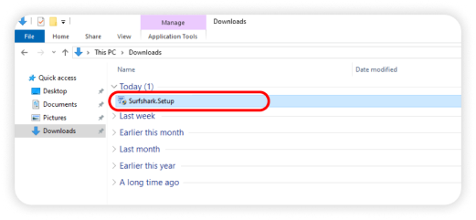  


##### Schritt 2: Einloggen
App öffnen → E-Mail & Passwort vom Signup eingeben.  


##### Schritt 3: Verbinden
„Quick-connect“ klicken oder aus Sidebar wählen (Fastest Server auto-pickt). Status zeigt „Connected“. Unbegrenzt simultan!  


#### FlowVPN Installations-Tutorial
Super für 1-2 Tage Gratis-Test.

##### Schritt 1: Herunterladen
Nach Signup/Trial: Von offizieller Site herunterladen (Windows-Beispiel).  


##### Schritt 2: Installieren & Verbinden
Installer ausführen → Setup abschließen. App starten → Mit Trial-Zugangsdaten einloggen. „Connect“ klicken → Land/Server aus Menü wählen. Zeigt „FlowVPN connected“, wenn aktiv.  
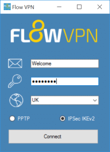

<a name="what-you-can-do-with-a-vpn-and-precautions"></a>
## Was du mit einem VPN machen kannst + Wichtige Vorsichtsmaßnahmen

Sobald connected, öffnet ein guter VPN das volle offene Internet – Streaming, Social, News, Lernen, Gaming und mehr. Hier, was sofort zugänglich wird:

- **Social & Messaging**: Twitter/X, Facebook, Instagram, YouTube, WhatsApp, Telegram, Line
- **Streaming-Plattformen**: Netflix (alle Bibliotheken), Hulu, HBO Max, Disney+, BBC iPlayer
- **Suche & Communities**: Google, Bing, DuckDuckGo, Reddit, Quora, Stack Overflow/Exchange, Medium, Wikipedia
- **Globale News**: CNN, BBC, New York Times, Washington Post, Guardian, Reuters, Al Jazeera, Bloomberg
- **Gaming & Downloads**: Steam, Epic Games, Origin, Battle.net, GOG, Twitch; Torrent-Seiten (P2P-Server nutzen)
- **Sichere Tools**: ProtonMail (verschlüsselte E-Mail), Tor (extra Anonymität), Coursera/Udemy/LinkedIn Learning

**Quick-Referenz-Tabelle – Top-Sites nach Kategorie**

| Kategorie             | Option 1                        | Option 2                     | Option 3                        | Option 4                   | Option 5                   |
|-----------------------|---------------------------------|------------------------------|---------------------------------|----------------------------|----------------------------|
| Video-Streaming       | [Netflix](https://www.netflix.com/) | [Hulu](https://www.hulu.com/) | [Amazon Prime Video](https://www.primevideo.com/) | [BBC iPlayer](https://www.bbc.co.uk/iplayer) | [Disney+](https://www.disneyplus.com/) |
| Musik-Streaming       | [Spotify](https://www.spotify.com/) | [Pandora](https://www.pandora.com/) | [Apple Music](https://www.apple.com/apple-music/) | [Tidal](https://tidal.com/) | [SoundCloud](https://soundcloud.com/) |
| Akademisch/Forschung  | [Google Scholar](https://scholar.google.com/) | [arXiv](https://arxiv.org/) | [IEEE Xplore](https://www.ieee.org/) | [JSTOR](https://www.jstor.org/) | [PubMed](https://pubmed.ncbi.nlm.nih.gov/) |
| Suchmaschinen         | [Google](https://www.google.com/) | [Bing](https://www.bing.com/) | [DuckDuckGo](https://duckduckgo.com/) | [Yahoo](https://www.yahoo.com/) | [Startpage](https://www.startpage.com/) |
| Comics/Manga/Anime    | [Marvel Unlimited](https://www.marvel.com/unlimited) | [DC Universe](https://www.dcuniverse.com/) | [ComiXology](https://www.comixology.com/) | [Crunchyroll](https://www.crunchyroll.com/) | [Webtoon](https://www.webtoons.com/) |
| Internationale News   | [CNN](https://www.cnn.com/) | [BBC](https://www.bbc.com/) | [Wall Street Journal](https://www.wsj.com/) | [The Guardian](https://www.theguardian.com/) | [Al Jazeera](https://www.aljazeera.com/) |
| Online-Kurse          | [Coursera](https://www.coursera.org/) | [edX](https://www.edx.org/) | [Khan Academy](https://www.khanacademy.org/) | [Udemy](https://www.udemy.com/) | [LinkedIn Learning](https://www.linkedin.com/learning/) |
| Soziale Netzwerke     | [Facebook](https://www.facebook.com/) | [Instagram](https://www.instagram.com/) | [Twitter/X](https://twitter.com/) | [LinkedIn](https://www.linkedin.com/) | [Pinterest](https://www.pinterest.com/) |

**Vorsichtsmaßnahmen & Best Practices**:
- VPN legal in deinem Land nutzen – illegale Aktivitäten vermeiden.
- Nie Free/unbekannte VPNs für sensible Tasks (Banking, E-Mails) – Risiko von Logs/Ads/Malware.
- Kill Switch + Auto-Connect immer aktivieren.
- Geschwindigkeiten/Server regelmäßig testen.
- Für Torrents: P2P-optimierte Server nutzen (Surfshark/StrongVPN).
- Mit neuer E-Mail verlängern für wiederholte Rabatte.

Nach der Einrichtung solltest du Kill Switch, DNS-Leak-Schutz und deine wichtigsten Apps testen, bevor die Rückerstattungsfrist abläuft.
### Ist die Nutzung eines VPNs für Datenschutz, Reisen und Streaming illegal?

In den meisten Ländern ist die Nutzung eines VPNs an sich **vollkommen legal** – Millionen Menschen tun es täglich für Privatsphäre, Arbeit, Reisen und Streaming. In wenigen Ländern (wie China, Russland, Iran, Nordkorea und anderen) werden unautorisierte VPNs stark eingeschränkt oder komplett verboten. Selbst dort ist die **Strafverfolgung gegen einzelne Nutzer** (Touristen, Expats oder normale User) extrem selten – Crackdowns zielen meist auf Anbieter, nicht auf Privatpersonen.

Das größere Problem: Behörden blocken oft VPN-Websites/Apps, sodass es schwer wird, eines herunterzuladen, wenn du schon drin bist.  
**Beste Praxis**: Lade und richte dein VPN **immer vor der Einreise** in ein restriktives Gebiet herunter. Bleib bei bewährten, zuverlässigen Anbietern wie **ExpressVPN** (Top-Obfuscation & schnelle Updates) oder **StrongVPN** (super für internationale Zahlungen & Stabilität).

**Wichtiger Hinweis**: Nutze VPN nie für illegale Aktivitäten. Halte dich an lokale Gesetze, um jedes Risiko zu minimieren.

## Warum wir Free-VPNs nicht empfehlen – Die echten Risiken
<a name="risks-of-free-vpns-why-we-dont-recommend-them"></a>

Free-VPNs klingen verlockend, kommen aber fast immer mit schweren Nachteilen, die jeden kostenlosen Vorteil überwiegen.

- **Privatsphäre & Datenverkauf**: Viele loggen und verkaufen deine Surf-History, Standort und persönliche Daten an Werbetreibende oder Dritte – das Gegenteil dessen, was ein VPN tun sollte.
- **Schreckliche Performance**: Langsame Geschwindigkeiten, häufige Abbrüche, lange Wartezeiten und Data Caps (z. B. 500 MB–2 GB/Tag) machen Streaming oder Surfen zur Qual.
- **Malware & Sicherheitsrisiken**: Manche bündeln Adware, Spyware, Crypto-Miner oder stehlen sogar Credentials/Banking-Infos. Free-Apps sind häufige Malware-Vektoren.
- **Rechtliche & Stabilitätsprobleme**: Viele operieren in Grauzonen oder schließen plötzlich – Nutzer bleiben exponiert.
- **Kein echter Support**: Null Kundenhilfe, keine Updates gegen neue Blocks – du bist auf dich allein gestellt.

**Real-World-Beispiele**: Nutzer von Free-VPNs wie Lantern, Hola, Betternet oder SuperVPN berichten von Datenlecks, Account-Übernahmen oder sogar Strafen in strengen Regionen. Ein einziger Breach kostet weit mehr als ein 3–6 $/Monat bezahlter Service.

**Fazit**: Free-VPNs sind das Risiko nicht wert. Investiere in ein Premium – selbst günstige bezahlte Langzeitangebote können bei ca. 1,73–2,01 EUR/Monat (1,99–2,30 USD/Monat) liegen, vor MwSt. und Verlängerung, und liefern echte Privatsphäre, Speed und Zuverlässigkeit.

## Warum es nicht empfehlenswert ist, deinen eigenen VPN zu bauen
<a name="why-not-build-your-own-vpn"></a>

Einen persönlichen VPN-Server aufzusetzen (z. B. auf VPS wie DigitalOcean/AWS mit OpenVPN/WireGuard) klingt clever für volle Kontrolle – ist aber selten praktikabel für Datenschutz, Reisen und Streaming.

- **Technische Komplexität**: Braucht tiefes Wissen über Server-Setup, Verschlüsselung, Protokolle, Firewall-Regeln, Zertifikatsmanagement und laufende Wartung. Ein Fehlconfig = Leaks oder Blocks.
- **Rechtliche Risiken**: In restriktiven Regionen kann ein eigener VPN mehr Aufmerksamkeit erregen als ein kommerzieller – manche Gesetze zielen explizit auf „unauthorisierte“ VPN-Dienste.
- **Hohe Kosten & Aufwand**: VPS-Miete (5–20 $/Monat), Bandbreiten-Gebühren, Domain-Setup, IP-Rotation gegen Blocks – summiert sich schnell und nimmt Zeit vom eigentlichen Internetnutzen.
- **Schlechte Performance & Stabilität**: Einzel-Server-Setups werden schnell blockiert; kein globales Netzwerk, keine Obfuscation, kein Load-Balancing. Kommerzielle VPNs investieren Millionen in Anti-Block-Tech.

**Urteil**: Außer du bist Netzwerk-Experte mit Zeit und Ressourcen, ist Eigenbau mehr Ärger als Nutzen. Kommerzielle Anbieter übernehmen die harten Teile – du musst nicht.

<a name="essential-vpn-knowledge-you-need-to-know"></a>
## Essentielles VPN-Wissen, das jeder kennen sollte

#### Was ist das Kernprinzip eines VPNs?
VPN = Virtual Private Network. Im Kern ist es **Verschlüsselung**. Deine Daten werden mit starker Mathematik (wie AES-256) in unleserliches Durcheinander verwandelt – nur der VPN-Server (mit dem richtigen Schlüssel) kann es entschlüsseln.  
All dein Traffic läuft durch einen verschlüsselten Tunnel, bevor er ins offene Internet geht. Das versteckt nicht nur deine IP, sondern auch Metadaten, die dein Browser leakt (Zeitzone, Sprache, OS, Bildschirmauflösung, Fonts) – die ein einzigartiges „Fingerprint“ für Tracking durch ISPs, Werbetreibende oder Behörden erzeugen können. Ein guter VPN stoppt das kalt.

#### Was sind globale Netzwerk-Sperren („strenge Netzwerkfilter“)?
Manche Regionen setzen strenge Internet-Kontrollen durch – Filterung, Überwachung und Blockierung in riesigem Maßstab. Die fortschrittlichsten nutzen:
- IP-Blocking
- DNS-Poisoning
- URL-Filterung
- Deep Packet Inspection
- Connection Resets

Beliebte Sites (Google, YouTube, Facebook, Twitter/X, WhatsApp, News) werden zuerst getroffen. Tools wie OONI Probe oder GreatFire.org zeigen Echtzeit-Blocks – der Umfang ist enorm und entwickelt sich ständig.

#### Was kann ein VPN wirklich für dich tun?
Durch Routing über einen entfernten Server und Änderung deiner sichtbaren IP/Location schaltet ein VPN frei:

- **Streaming-Bibliotheken**: Voll Netflix, Hulu, Disney+, BBC iPlayer, Amazon Prime in anderen Ländern.
- **Zensur umgehen**: Zugang zu blockierten News, Social Media, Foren.
- **Privatsphäre schützen**: IP verstecken, Traffic verschlüsseln, ISP/Behörden-Snooping stoppen.
- **Öffentliches Wi-Fi sichern**: Sicheres Surfen in Cafés, Flughäfen, Hotels.
- **Remote-Zugriff**: Sichere Verbindung zu Arbeit/Schule-Netzwerken.

Verantwortungsvoll und legal nutzen – VPNs sind Tools für Freiheit und Privatsphäre, nicht zum Gesetzesbrechen.

Teste deinen Anbieter mit den Diensten, die du wirklich nutzt, und entscheide nach realer Geschwindigkeit, App-Qualität und Support.

#### Sind VPNs wirklich effektiv?
Die Wirksamkeit von VPNs wird diskutiert, aber nach Jahren täglicher Tests in restriktiven Regionen ist die klare Wahrheit: **Ja, bezahlte Premium-VPNs sind hoch effektiv**, wenn du zuverlässige wählst wie **ExpressVPN** (beste für harte Blocks & Speed) oder **StrongVPN** (super Value & internationale Zahlungen). Sie umgehen Sperren konstant, schützen Privatsphäre und liefern nutzbare Geschwindigkeiten für Streaming/Gaming/Arbeit.

Skeptizismus ist fair. Manche „VPNs“ haben shady Historien:
- Facebooks Onavo (Project Atlas) zahlte User $20/Monat für Root-Zugriff und tiefe Datensammlung – quasi Spyware getarnt als VPN.
- Hola VPN machte Free-User zu unwissendem Botnet (verkaufte ihre Bandbreite), erst nach massivem Backlash gefixt.

**Quick Effectiveness-Test**:
1. Verbinde zu Server in anderem Land.
2. Besuche whatismyipaddress.com – deine IP sollte zur Server-Location wechseln.
3. Zugriff auf blockierte Site versuchen (z. B. Google, YouTube oder Netflix US-Bibliothek).
4. ipleak.net oder dnsleaktest.com laufen lassen – keine Leaks = es funktioniert richtig.

Premium-VPNs bestehen das zuverlässig; Free/Billig oft mit Leaks oder Fail.

#### Brauchst du einen VPN in Hong Kong?
Hongkongs Internetfreiheit hat stark abgenommen – „Partly Free“ in aktuellen Freedom House Reports wegen zunehmender Überwachung, Content-Entfernung und Verhaftungen wegen „kritischer“ Meinungen. Keine volle Zensur wie stark regulierte Netzwerke, aber Behörden überwachen Traffic, und öffentliches Wi-Fi ist riskant.

**Ja, VPN wird empfohlen** für Privatsphäre-Schutz gegen mögliches Tracking durch ISPs/Behörden/Hacker – besonders für Journalisten, Aktivisten oder alle mit sensiblen Themen. Hilft auch bei internationalen News/Streaming ohne Störung.

#### Brauchst du einen VPN in Taiwan?
Taiwan hat eines der freiesten Internets weltweit – keine weitverbreitete Zensur, schnelle Speed und starke digitale Rechte. Für normales Surfen/Streaming/Social Media **brauchst du streng genommen keinen VPN** für bestimmte Blockaden.

Allerdings ist er **sehr nützlich** für:
- Privatsphäre auf öffentlichem Wi-Fi (Cafés, MRT, Flughäfen – beliebte Hacker-Ziele).
- Vermeidung von ISP/Werbe-Tracking.
- Zugang zu geo-blockiertem Content (z. B. US-Netflix, BBC iPlayer).
- Extra-Sicherheit beim Reisen oder Shared-Netzwerken.

Kurz: Nicht zwingend, aber smart für alle, die Privatsphäre schätzen.

#### Wo brauchen Menschen wirklich einen VPN (außer spezifischen Regionen)?
Während stark restriktive Gebiete den meisten VPN-Bedarf treiben, profitieren Menschen überall aus unterschiedlichen Gründen:

- **Russland**: Blockt Facebook, Instagram, Twitter/X, BBC, unabhängige News – VPNs essenziell für uncensored Zugang.
- **Iran**: Schwere Filterung von Social Media, News & Apps – VPNs tägliche Notwendigkeit.
- **Türkei**: Periodische Blocks auf Twitter/X, YouTube, Wikipedia – VPNs stellen Zugriff wieder her.
- **UAE/Saudi-Arabien**: VoIP-Apps (WhatsApp-Calls, Skype, FaceTime) blockiert – VPNs ermöglichen sie.
- **Stark regulierte Netzwerke**: Strenge Netzwerkfilter können wichtige Dienste blockieren.
- **Sogar in „freien“ Ländern** (USA, UK, Europa, Australien, Taiwan, Japan etc.):
  - Privatsphäre vor ISP/Werbe-/Behörden-Tracking.
  - Öffentliches Wi-Fi-Sicherheit.
  - Umgang mit Geo-Blocks für günstigere Flüge, Streaming-Bibliotheken oder Work-Tools.

Fazit: VPNs sind nicht nur für zensierte Regionen – sie sind für jeden, der Privatsphäre, Sicherheit und vollen Internetzugriff will.

#### Mein bezahlter VPN funktioniert nicht – Was tun?
Bezahlte VPNs scheitern seltener, aber wenn, folge dieser Troubleshooting-Reihenfolge (funktioniert bei ExpressVPN, Surfshark, StrongVPN etc.):

1. **Basis-Checks & Restart**:
   - Username/Passwort/Aktivierungscode prüfen.
   - Gerät + Router + VPN-App neustarten.
   - App auf neueste Version updaten.

2. **Quick-Fixes**:
   - Server wechseln („Best/Fastest“ oder nahen Länder probieren).
   - Protokoll ändern (WireGuard → IKEv2 → OpenVPN UDP/TCP).
   - Obfuscation/Camouflage/NoBorders-Modus aktivieren, falls verfügbar.
   - Auf Mobile-Data statt Wi-Fi testen.

3. **Fortgeschrittene Schritte**:
   - App-Cache löschen (in App oder Gerät-Settings).
   - App neu installieren.
   - Custom DNS: 8.8.8.8 + 8.8.4.4 (Google) oder 1.1.1.1 (Cloudflare) probieren.

4. **Support kontaktieren**:
   - 24/7 Live-Chat nutzen (ExpressVPN/Surfshark/StrongVPN haben exzellente).
   - Angeben: Gerät/OS, Fehlermeldung, was du schon probiert hast.
   - Sie diagnostizieren oft remote, schicken Custom-Configs oder refunden bei Unfixable.

Die meisten Probleme lösen sich in Minuten mit Support. Bei anhaltendem Fail: Zu Backup-VPN wechseln (immer 2–3 installiert haben).

Teste deinen Anbieter mit den Diensten, die du wirklich nutzt, und entscheide nach realer Geschwindigkeit, App-Qualität und Support.

### Fortgeschrittene VPN-Nutzung & Vorteile

#### Double oder Multi-Hop VPNs – Wie & Warum nutzen
<a name="double-multi-hop-vpn-uses-benefits"></a>

Ein Double- (oder Multi-Hop-)VPN leitet deinen Traffic durch **zwei oder mehr Server** statt nur einen – Verbindung läuft: Du → Server 1 → Server 2 → Internet. Das fügt eine extra Schutzschicht hinzu, kostet aber meist etwas Speed.

##### Wichtige Vorteile
1. **Stärkere Privatsphäre & Anonymität**  
   Deine echte IP wird hinter dem ersten Server versteckt – selbst wenn Server 2 kompromittiert oder subpoenaed wird, sieht er nur Server 1 – nicht dich. Tracing deiner Aktivitäten wird extrem schwer.

2. **Extra-Schutz gegen Überwachung & Leaks**  
   Ideal für High-Risk-Szenarien: Sensible Daten auf öffentlichem Wi-Fi (Cafés, Flughäfen, Hotels), Journalismus in überwachten Regionen oder Paranoia vor ISP/Behörden-Logging. Bei Fail eines Hops schützt der zweite noch.

3. **Besser gegen harte Zensur**  
   In Ländern mit aggressiver Filterung (z. B. Russland, Iran oder Enterprise-Netzwerke) können Server-Chains über verschiedene Länder/Jurisdiktionen Detection zuverlässiger umgehen als Single-Hop.

**Wie einrichten**  
- **Built-in Multi-Hop**: Surfshark (MultiHop), ProtonVPN (Secure Core), NordVPN (Double VPN) – in App-Settings aktivieren.  
- **Manuelles Chainen**: Zuerst einen VPN connecten (z. B. StrongVPN), dann zweiten drüber (z. B. ExpressVPN) – funktioniert, aber komplexer & langsamer.  
- **Best For**: Privacy-Extremisten oder Nutzer in stark überwachten Gebieten.  
**Trade-Off**: Erwarte 10–30 % Speed-Verlust durch doppelte Verschlüsselung & Routing. Nur nutzen, wenn Privatsphäre > Performance.

#### Wie VPNs die Internetgeschwindigkeit beeinflussen – Real Talk
<a name="vpn-impact-on-network-speed"></a>

VPNs bringen Sicherheit, Privatsphäre und globalen Zugriff – verlangsamen aber fast immer etwas. Hier genau warum und wie viel in 2026 zu erwarten.

##### Hauptgründe für Speed-Verlust
1. **Verschlüsselungs-Overhead**  
   Jeder Paket verschlüsseln/entschlüsseln braucht CPU und addiert winzige Delays. Moderne Protokolle wie WireGuard minimieren das (oft <5–10 % Verlust auf guter Hardware), ältere (OpenVPN) können 20–40 %.

2. **Server-Entfernung**  
   Physik-Regel: Je weiter der Server, desto höhere Latenz und niedrigere Speed. 10.000 km entfernt addiert Ping und reduziert Throughput.  
   **Daumenregel**: Server in deiner Region oder nah wählen – z. B. Taiwan → Japan/Singapur/Hongkong für beste Geschwindigkeiten.

3. **Server-Load & Qualität**  
   Peak-Zeiten überlasten beliebte Server → langsamere Speed. Premium-Anbieter (ExpressVPN, Surfshark) investieren massiv in Infrastruktur und auto-optimieren zum least-loaded/schnellsten Server.

4. **Deine Basis-Verbindung**  
   VPN kann dein Internet nicht schneller machen als es ist. Bei 100 Mbps ISP mit Wi-Fi-Störungen oder altem Router zeigt VPN diese Issues stärker.

##### Realistische Erwartungen (2026-Tests)
- Auf 1 Gbps Fiber + WireGuard + nahem Server: 700–950 Mbps (5–30 % Verlust, oft unmerklich für Streaming/Gaming).  
- Entfernter Server oder älteres Protokoll: 300–600 Mbps (immer noch genug für 4K Netflix, Zoom, Downloads).  
- Multi-Hop: 200–500 Mbps (nutzbar, aber merkbar bei Heavy-Use).

**Tipps zur Minimierung von Speed-Verlust**  
- WireGuard oder Lightway (ExpressVPN) nutzen.  
- „Fastest Server“ oder nahe Locations wählen.  
- Vorher/Nachher mit speedtest.net testen.  
- Free/Billig-VPNs vermeiden – die throtteln oder cap stark.  
- Router/Modem upgraden, wenn Basis-Speed niedrig.

Fazit: Mit gutem bezahltem VPN und smarten Choices ist Speed-Verlust minimal – du bekommst Privatsphäre und Zugriff ohne Alltagsnutzung zu opfern.

Du hast jetzt fortgeschrittene Tipps, um das Maximum aus deinem VPN rauszuholen. Wähle das richtige Setup für deine Bedürfnisse, teste es und genieße sicheres Surfen.

#### Wenn Streaming-Dienste ein VPN blockieren

Streaming-Anbieter blockieren regelmäßig einzelne VPN-IP-Adressen. Ein Fehler bedeutet nicht automatisch, dass der Anbieter unbrauchbar ist.

- Anderen Server im selben Land testen.
- Cookies löschen oder privaten Browser nutzen.
- DNS/WebRTC-Leaks prüfen.
- Bei mobilen Apps Standortfreigabe kontrollieren.
- Während der typischen Nutzungszeit testen, etwa abends oder am Wochenende.

Für deutsche Nutzer zählt am Ende, ob Mediathek, Sport, Datenschutz und Geräte-Support im eigenen Setup funktionieren.

## Fortgeschrittene VPN-Nutzung & Kompatibilität

#### Warum & Wie regelmäßig VPN-Anbieter rotieren für extra Sicherheit
<a name="how-to-rotate-vpn-providers-for-better-security"></a>

Selbst mit solidem VPN: Alle paar Monate rotieren fügt eine extra Schutzschicht hinzu – reduziert langfristiges Tracking-Risiko bei Breach, Subpoena oder undetected Logging eines Anbieters.

##### Schritte zum sicheren Rotieren
1. **Zeitplan setzen**: Alle 3–6 Monate (oder nach großen News wie Audits/Breaches). Mit Budget abstimmen – viele haben Long-Term-Deals.
2. **Nächsten recherchieren**: Priorisiere auditiertes No-Logs, starke Obfuscation, benötigte Locations & Features (z. B. unbegrenzte Geräte bei Surfshark, Top-Speed bei ExpressVPN).
3. **Alten VPN vollständig entfernen**:
   - App komplett deinstallieren.
   - Configs/Profile löschen.
   - Gerät neustarten, um Netzwerk-Reste zu clearen.
4. **Neuen gründlich testen**:
   - Speed-Tests (speedtest.net).
   - Leak-Checks (ipleak.net, dnsleaktest.com).
   - Streaming/Gaming-Trials.
   - Stabilität über ein paar Tage.
5. **Bonus-Tipp**: Immer 2–3 als Backups installiert halten – schnell wechseln bei Block.

Extra Aufwand, aber für High-Privacy-Nutzer smarte Gewohnheit. Die meisten bleiben langfristig bei einem Top-Anbieter – Rotieren gibt aber extra Peace of Mind.


### FlowVPN für Apple TV – Warum es heraussticht
<a name="vpn-for-apple-tv"></a>

FlowVPN führt bei Apple TV-Kompatibilität mit seiner dedizierten **tvOS-App** (verfügbar via TestFlight-Beta in 2026). Das bringt volle VPN-Power direkt ins Wohnzimmer – globale Streaming-Bibliotheken freischalten, Smart-Home-Privatsphäre schützen und Geo-Blocks auf Apple TV umgehen, ohne kompliziertes Router-Setup.

Wichtige Vorteile:
- Entsperrt Netflix, Disney+, BBC iPlayer, Prime Video und mehr weltweit.
- Starke Verschlüsselung + No-Logs-Policy für sicheres Streaming.
- Einfache TestFlight-Installation – kein Sideloading-Stress.
- Funktioniert nahtlos mit iPhone/iPad für Kontrolle.

#### Apple TV Setup-Tutorial (tvOS 17+ Beta)
1. **Anmelden / Trial**: Account erstellen oder 1-2 Tage Gratis-Test nutzen: [FlowVPN – Gratis-Test](https://www.flowvpx.com/sign-up/?locale=de&special=FREETRIAL&r=35-890485.w_github_de).
2. **TestFlight auf iPhone/iPad/Mac installieren**: [TestFlight im App Store](https://apps.apple.com/app/testflight/id899247664).
3. **FlowVPN Beta beitreten**: Auf iOS/Mac-Gerät [FlowVPN Apple TV Beta](https://www.flowvpn.com/beta-tv) besuchen → Invite-Code einlösen.
4. **Auf Apple TV installieren**: TestFlight auf Apple TV öffnen (aus tvOS App Store laden falls nötig) → FlowVPN Beta installieren.
5. **Einloggen & Verbinden**: Mit Zugangsdaten einloggen → Server wählen (z. B. US für Netflix US, UK für BBC) → Unbeschränktes TV genießen.

FlowVPNs Apple TV-Support setzt neuen Maßstab für Home-Entertainment-Privatsphäre und Zugriff. Risikofrei testen – passt es zu deinem Setup, ist es ein Game-Changer für Cord-Cutter und globale Streamer.
**FlowVPN für Apple TV**: Während andere nachziehen, definiert FlowVPN die Zukunft von Home-Streaming-Privatsphäre und Zugriff neu.

### VPNs & Netflix entsperren – Wie es 2026 funktioniert
Netflix bleibt der weltgrößte Streaming-Dienst, mit Bibliotheken, die je Land stark variieren – US hat den größten Katalog, andere Regionen andere Shows/Filme wegen Lizenzierung. Ein VPN ändert deine virtuelle Location, sodass du wie aus einem unterstützten Land wirkst und vollen Zugriff bekommst.

Netflix hat VPN-Detection massiv verbessert (IP-Blacklisting, Behavioral Analysis), aber Premium-Anbieter umgehen das zuverlässig durch häufige Server-Rotation, Obfuscation und dedizierte Streaming-IPs. Monatliche Tests über echte Verbindungen – hier der aktuelle Leaderboard (Januar 2026) für konsistentes Netflix-Unblocking:

| VPN-Anbieter | Zuverlässig entsperrte Regionen (Test Jan 2026)               | Notes / Herausragende Performance |
|--------------|---------------------------------------------------------------|-----------------------------------|
| ExpressVPN   | US, Kanada, UK, Frankreich, Japan, Australien, Deutschland, Brasilien | Top-Konsistenz & Speed für 4K; selten Server-Wechsel nötig |
| StrongVPN    | US, UK, Deutschland, Japan, Kanada, Australien               | Exzellenter Value; stark bei US/UK-Bibliotheken |
| Surfshark    | Kanada, Australien, Japan, Deutschland, US, UK, Niederlande | Unbegrenzte Geräte + super Multi-Region-Support |
| FlowVPN      | US, Kanada, UK, Australien, Japan, Deutschland               | Solider Allrounder; gut für gemischtes Streaming |

**Pro-Tipp**: Immer zu „streaming-optimierten“ oder nahen Servern connecten. Bei Fail: Wechseln – Premium-VPNs rotieren IPs schnell. Free-VPNs vermeiden – Netflix blockt sie fast sofort.

### VPNs & Disney+ entsperren – Aktueller Status
Disney+ Inhalte variieren enorm je Region (z. B. Marvel/Star Wars-Exklusives unterschiedlich, plus lokale Originale). Ein VPN spoofs deine Location für volleren Zugriff, aber Detection hat sich verbessert (ähnlich Netflix). Monatliche Tests halten die Liste frisch:

| VPN-Anbieter | Zuverlässig entsperrte Regionen (Test Jan 2026)               | Notes / Herausragende Performance |
|--------------|---------------------------------------------------------------|-----------------------------------|
| ExpressVPN   | Frankreich, US, Australien, Kanada, UK, Japan, Deutschland   | Bestes Gesamtpaket für Disney+ – schnelle Ladezeiten, seltene Fehler |
| StrongVPN    | UK, US, Südafrika, Australien, Kanada, Deutschland           | Stark bei US/UK; gut für internationale Reisen |
| Surfshark    | US, UK, Kanada, Australien, Japan, Niederlande, Frankreich   | Unbegrenzte Verbindungen – perfekt für Familie |
| FlowVPN      | US, UK, Deutschland, Australien, Japan, Kanada               | Zuverlässiger Performer; super für Apple TV-Nutzer |

**Quick-Rat für beide Dienste**:
- WireGuard oder Lightway-Protokoll für schnellstes Streaming nutzen.
- Kill Switch aktivieren, um versehentliche Exposure zu vermeiden.
- Bei neuem Anbieter zuerst auf unkritischem Gerät testen.
- Bei Flaggen Server rotieren – Top-VPNs haben Hunderte bereit.

Diese vier liefern 2026 konstant in unseren Tests – ExpressVPN führt bei Premium-Zuverlässigkeit, Surfshark bei Value/Unbegrenzt, StrongVPN bei Budget-International und FlowVPN bei Apple TV-Innovation. Wähle nach Geräten und Prioritäten – und genieße volle globale Kataloge ohne Grenzen.

<a name="introduction-to-common-vpn-protocols"></a>
## VPN-Protokolle für normale Nutzer

Starte mit der automatischen Einstellung der App. Wechsle das Protokoll nur, wenn Geschwindigkeit, Stabilität oder ein bestimmtes WLAN Probleme machen.

| Protokoll | Geeignet für | Hinweis |
|---|---|---|
| WireGuard / Lightway | Streaming, Speed, Mobilgeräte | meist die beste erste Wahl |
| OpenVPN UDP | gute Mischung aus Speed und Stabilität | solide für Heimnetz und Alltag |
| OpenVPN TCP | Hotel, Uni, Büro, restriktives WLAN | langsamer, aber oft robuster |
| IKEv2 | Smartphone und Netzwerkwechsel | praktisch auf Reisen |

### Unterschiede & Use Cases: VPN vs. Tor
<a name="differences-and-use-cases-vpn-vs-tor"></a>

**VPN** (Virtual Private Network) und **Tor** (The Onion Router) boosten beide Privatsphäre und Sicherheit, sind aber für unterschiedliche Ziele gebaut.

#### 1. VPN: Verschlüsselung + Speed + Vielseitigkeit
- **Verschlüsselt allen Traffic**: Voller End-to-End-Tunnel versteckt alles vor ISPs/Hackern.
- **Versteckt deine IP**: Du erscheinst am VPN-Server-Standort.
- **Umgeht Geo-Blocks**: Exzellent für Streaming (Netflix, Disney+), Gaming, Arbeit.
- **Trust-Faktor**: Hängt vom Anbieter ab – auditiertes No-Logs wählen (ExpressVPN, Surfshark, StrongVPN).
- **Speed**: Meist schnell (minimaler Verlust mit WireGuard).
- **Best For**: Alltags-Privatsphäre, Streaming, Public-Wi-Fi-Sicherheit, Remote-Zugriff.

#### 2. Tor: Maximale Anonymität + Multi-Layer-Routing
- **Dreifache Verschlüsselung**: Daten bouncen durch drei zufällige Volunteer-Nodes (Entry → Middle → Exit) – kein Node kennt den vollen Pfad.
- **Starke Anonymität**: Extrem schwer zurückzuverfolgen.
- **Dark-Web-Zugriff**: Ermöglicht .onion-Sites.
- **Nachteile**: Viel langsamer (Multi-Hop + Volunteer-Relays), nicht ideal für Streaming/Video-Calls, Exit-Nodes können überwacht werden (immer HTTPS nutzen).
- **Wahrnehmung**: Oft mit illegalen Aktivitäten verknüpft (obwohl die meisten Nutzung legitim für Privatsphäre ist).

**Wann welches wählen**  
- **VPN** für Speed, Streaming, Gaming, allgemeine Privatsphäre und Geo-Umgehung.  
- **Tor** für ultimative Anonymität (z. B. Whistleblower, Journalisten in High-Risk-Gebieten) oder Hidden Services.  
Viele kombinieren: VPN für täglich + Tor Browser für sensible Sessions.

Wähle nach deinem Threat Model – die meisten bekommen 95 % der Vorteile von einem guten bezahlten VPN ohne Tor-Slowdowns.

<a name="differences-between-vpn-and-proxy-servers"></a>
### VPN vs. Proxy-Server – Wichtige Unterschiede
VPNs und Proxies bieten beide etwas Anonymität, arbeiten aber sehr unterschiedlich bei Sicherheit, Speed und Schutz.


### Fortgeschrittene VPN-Nutzung & Vorteile

#### Double oder Multi-Hop VPNs – Wie & Warum nutzen
<a name="double-multi-hop-vpn-uses-benefits"></a>

Ein Double- (oder Multi-Hop-)VPN leitet deinen Traffic durch **zwei oder mehr Server** statt nur einen – Verbindung läuft: Du → Server 1 → Server 2 → Internet. Das fügt eine extra Schutzschicht hinzu, kostet aber meist etwas Speed.

##### Wichtige Vorteile
1. **Stärkere Privatsphäre & Anonymität**  
   Deine echte IP wird hinter dem ersten Server versteckt – selbst wenn Server 2 kompromittiert oder subpoenaed wird, sieht er nur Server 1 – nicht dich. Tracing deiner Aktivitäten wird extrem schwer.

2. **Extra-Schutz gegen Überwachung & Leaks**  
   Ideal für High-Risk-Szenarien: Sensible Daten auf öffentlichem Wi-Fi (Cafés, Flughäfen, Hotels), Journalismus in überwachten Regionen oder Paranoia vor ISP/Behörden-Logging. Bei Fail eines Hops schützt der zweite noch.

3. **Besser gegen harte Zensur**  
   In Ländern mit aggressiver Filterung (z. B. Russland, Iran oder Enterprise-Netzwerke) können Server-Chains über verschiedene Länder/Jurisdiktionen Detection zuverlässiger umgehen als Single-Hop.

**Wie einrichten**  
- **Built-in Multi-Hop**: Surfshark (MultiHop), ProtonVPN (Secure Core), NordVPN (Double VPN) – in App-Settings aktivieren.  
- **Manuelles Chainen**: Zuerst einen VPN connecten (z. B. StrongVPN), dann zweiten drüber (z. B. ExpressVPN) – funktioniert, aber komplexer & langsamer.  
- **Best For**: Privacy-Extremisten oder Nutzer in stark überwachten Gebieten.  
**Trade-Off**: Erwarte 10–30 % Speed-Verlust durch doppelte Verschlüsselung & Routing. Nur nutzen, wenn Privatsphäre > Performance.

#### Wie VPNs die Internetgeschwindigkeit beeinflussen – Real Talk
<a name="vpn-impact-on-network-speed"></a>

VPNs bringen Sicherheit, Privatsphäre und globalen Zugriff – verlangsamen aber fast immer etwas. Hier genau warum und wie viel in 2026 zu erwarten.

##### Hauptgründe für Speed-Verlust
1. **Verschlüsselungs-Overhead**  
   Jeder Paket verschlüsseln/entschlüsseln braucht CPU und addiert winzige Delays. Moderne Protokolle wie WireGuard minimieren das (oft <5–10 % Verlust auf guter Hardware), ältere (OpenVPN) können 20–40 %.

2. **Server-Entfernung**  
   Physik-Regel: Je weiter der Server, desto höhere Latenz und niedrigere Speed. 10.000 km entfernt addiert Ping und reduziert Throughput.  
   **Daumenregel**: Server in deiner Region oder nah wählen – z. B. Taiwan → Japan/Singapur/Hongkong für beste Geschwindigkeiten.

3. **Server-Load & Qualität**  
   Peak-Zeiten überlasten beliebte Server → langsamere Speed. Premium-Anbieter (ExpressVPN, Surfshark) investieren massiv in Infrastruktur und auto-optimieren zum least-loaded/schnellsten Server.

4. **Deine Basis-Verbindung**  
   VPN kann dein Internet nicht schneller machen als es ist. Bei 100 Mbps ISP mit Wi-Fi-Störungen oder altem Router zeigt VPN diese Issues stärker.

##### Realistische Erwartungen (2026-Tests)
- Auf 1 Gbps Fiber + WireGuard + nahem Server: 700–950 Mbps (5–30 % Verlust, oft unmerklich für Streaming/Gaming).  
- Entfernter Server oder älteres Protokoll: 300–600 Mbps (immer noch genug für 4K Netflix, Zoom, Downloads).  
- Multi-Hop: 200–500 Mbps (nutzbar, aber merkbar bei Heavy-Use).

**Tipps zur Minimierung von Speed-Verlust**  
- WireGuard oder Lightway (ExpressVPN) nutzen.  
- „Fastest Server“ oder nahe Locations wählen.  
- Vorher/Nachher mit speedtest.net testen.  
- Free/Billig-VPNs vermeiden – die throtteln oder cap stark.  
- Router/Modem upgraden, wenn Basis-Speed niedrig.

Fazit: Mit gutem bezahltem VPN und smarten Choices ist Speed-Verlust minimal – du bekommst Privatsphäre und Zugriff ohne Alltagsnutzung zu opfern.

Du hast jetzt fortgeschrittene Tipps, um das Maximum aus deinem VPN rauszuholen. Wähle das richtige Setup für deine Bedürfnisse, teste es und genieße sicheres Surfen.

#### Wenn Streaming-Dienste ein VPN blockieren

Streaming-Anbieter sperren regelmäßig einzelne VPN-IP-Adressen. Ein Fehler bedeutet nicht automatisch, dass der Anbieter unbrauchbar ist.

- Anderen Server im selben Land testen.
- Cookies löschen oder privaten Browser nutzen.
- DNS/WebRTC-Leaks prüfen.
- Bei mobilen Apps Standortfreigabe kontrollieren.
- Während der typischen Nutzungszeit testen, etwa abends oder am Wochenende.

Für deutsche Nutzer zählt am Ende, ob Mediathek, Sport, Datenschutz und Geräte-Support im eigenen Setup funktionieren.

## Fortgeschrittene VPN-Nutzung & Kompatibilität

#### Warum & Wie regelmäßig VPN-Anbieter rotieren für extra Sicherheit
<a name="how-to-rotate-vpn-providers-for-better-security"></a>

Selbst mit solidem VPN: Alle paar Monate rotieren fügt eine extra Schutzschicht hinzu – reduziert langfristiges Tracking-Risiko bei Breach, Subpoena oder undetected Logging eines Anbieters.

##### Schritte zum sicheren Rotieren
1. **Zeitplan setzen**: Alle 3–6 Monate (oder nach großen News wie Audits/Breaches). Mit Budget abstimmen – viele haben Long-Term-Deals.
2. **Nächsten recherchieren**: Priorisiere auditiertes No-Logs, starke Obfuscation, benötigte Locations & Features (z. B. unbegrenzte Geräte bei Surfshark, Top-Speed bei ExpressVPN).
3. **Alten VPN vollständig entfernen**:
   - App komplett deinstallieren.
   - Configs/Profile löschen.
   - Gerät neustarten, um Netzwerk-Reste zu clearen.
4. **Neuen gründlich testen**:
   - Speed-Tests (speedtest.net).
   - Leak-Checks (ipleak.net, dnsleaktest.com).
   - Streaming/Gaming-Trials.
   - Stabilität über ein paar Tage.
5. **Bonus-Tipp**: Immer 2–3 als Backups installiert halten – schnell wechseln bei Block.

Extra Aufwand, aber für High-Privacy-Nutzer smarte Gewohnheit. Die meisten bleiben langfristig bei einem Top-Anbieter – Rotieren gibt aber extra Peace of Mind.


### VPN-Erfolgsraten für Netflix & Disney+ (Januar 2026 Tests)

<a name="vpn-success-rate-for-netflix-and-disney-plus"></a>
## VPN-Erfolgsraten für Netflix & Disney+ (Jan 2026 Tests)

#### Netflix-Verbindungs-Erfolgsraten nach Kontinent
<a name="netflix-connection-success-rates-by-continent"></a>

Dieses Diagramm zeigt die realen Erfolgsraten (%) unserer Top-4-VPNs (ExpressVPN, FlowVPN, Surfshark, StrongVPN) beim Zugriff auf Netflix-Bibliotheken nach Kontinenten. Jede Untergrafik steht für einen Anbieter, Kontinente auf der X-Achse, Erfolgsprozent auf der Y-Achse.

Wichtige Highlights:
- **Asien, Europa, Ozeanien**: Nahezu perfekt – ideal für konsistentes Streaming von US/UK/Japan-Bibliotheken.
- **Nordamerika**: Extrem hoch bei allen Anbietern.
- **Afrika & Südamerika**: Niedrigere Durchschnitte durch lokale Netzwerk-Herausforderungen und weniger optimierte Server, aber mit nahen Optionen machbar.

Wähle nach deinem Standort – diese Raten sind Durchschnitte aus täglichen Tests der letzten 7–30 Tage.


#### Disney+-Verbindungs-Erfolgsraten nach Kontinent
<a name="disney-plus-connection-success-rates-by-continent"></a>

Ähnliche Aufschlüsselung für Disney+ – Erfolgs-% für weltweiten Bibliothekszugriff.

Highlights:
- **Asien, Europa, Ozeanien**: Exzellente Stabilität – super für Marvel, Star Wars oder regionale Exklusives.
- **Nordamerika**: Top-Performance.
- **Afrika & Südamerika**: Variabler durch Infrastruktur – US/UK/EU-Server für beste Ergebnisse probieren.

Wähle deinen VPN nach primärer Region und Streaming-Prioritäten.


<a name="guide-to-streaming-with-vpn"></a>
## Schritt-für-Schritt-Guide: Globales Streaming mit VPN genießen

> „Wir leben in einer grenzenlosen Welt – warum sollte unsere Unterhaltung Grenzen haben?“ — Ein Internet-Philosoph.

Stell dir vor: Du sitzt mit Snacks auf der Couch, bereit für neuen Netflix-Drama, YouTube oder neuesten Disney+-Film – und das alles bei Kaffee in Madrid (oder überall). Geo-Restriktionen können die Stimmung verderben, aber ein guter VPN fix das sofort.

Hier dein einfacher Guide, um Barrieren zu brechen und weltweite Unterhaltung mit **StrongVPN** und **ExpressVPN** freizuschalten – die zuverlässigsten für Streaming in unseren täglichen Tests.

### Schritt 1: Den richtigen VPN für Streaming wählen
Wir fokussieren auf bewährte Performer, die Netflix, Disney+, Hulu, BBC iPlayer & mehr konstant entsperren.

- **[StrongVPN](https://strongvpn.com/de/?tr_aid=60d96b5810e50&chan=w_github_de&data1=de-body&data2=title)**: Geliebt für felsstabile Performance und Einfachheit. 950+ Server in 70+ Regionen – perfekt für jeden Ort, super Value und starke internationale Zahlungsunterstützung.
- **[ExpressVPN](https://go.expressvpn.com/c/3828265/1509266/16063)**: Der „Speed-König“ – 3.000+ Server in 94 Ländern, blitzschnelles Lightway-Protokoll und unschlagbare Konsistenz für 4K-Streaming ohne Buffering.

  


### Schritt 2: VPN installieren & einrichten
Installation dauert unter 5 Minuten – einfacher als die meisten Apps.

1. **Anmelden**: Einen der Links oben klicken, besten Deal schnappen (unsere Exklusiv-Links für Boni wie Extra-Gratis-Monate).
2. **App herunterladen**: Client für dein Gerät holen (Windows, Mac, iOS, Android oder Router für Apple TV/Fire TV).
3. **Einloggen**: E-Mail/Passwort nutzen (oder Aktivierungscode bei ExpressVPN).
4. **Zum richtigen Server connecten**: Land passend zum gewünschten Content wählen:
   - US für Netflix US / Disney+ US (größte Bibliotheken)
   - UK für BBC iPlayer / extra Disney+ Content
   - Japan für Anime-Exklusives
   - Kanada/Australien für regionale Perlen
   „Fastest Server“ oder streaming-optimierte nutzen, falls verfügbar.

### Schritt 3: Losstreamen
- Netflix/Disney+/Hulu/etc. öffnen.
- Show/Film suchen – sollte jetzt erscheinen.
- Buffer-frei in 4K/HDR genießen (WireGuard/Lightway-Protokoll empfohlen).
- Pro-Tipps: Kill Switch für Sicherheit aktivieren, auf Wi-Fi/Mobile-Data testen, Server wechseln bei Flaggen (selten bei diesen Anbietern).

Mit StrongVPN oder ExpressVPN bist du bereit für globale Unterhaltung ohne Grenzen. Risikofrei testen (30-Tage-Geld-zurück) und den Unterschied sehen – kein „nicht verfügbar in deiner Region“ mehr.

Viel Spaß beim Bingen – die Welt der Inhalte gehört dir!

### Schritt 3: Tauche in dein Streaming ein
Netflix, Disney+, YouTube, Hulu oder deine Lieblings-App öffnen – und genießen! Bei leichtem Speed-Dip (selten bei Premium-VPNs): Server wechseln („Fastest“ oder nahe Optionen) oder 24/7 Live-Chat-Support für instant Hilfe.

> „Das Leben hat schon genug Grenzen – unsere Unterhaltung sollte keine haben.“

Befreie dich mit StrongVPN oder ExpressVPN und erlebe den vollen globalen Katalog, ohne Grenzen, ohne Ausreden. Starte dein Abo heute – dein nächstes Binge wartet!

<a name="how-netflix-and-hulu-detect-and-block-vpns"></a>
## Wie Netflix & Hulu VPN-Verbindungen erkennen & blocken

Streaming-Riesen wie Netflix und Hulu erzwingen Geo-Restriktionen wegen Lizenzdeals – Inhalte variieren enorm je Land. Sie erkennen und blocken VPNs aktiv, um diese Regeln durchzusetzen. Hier wie (und warum Premium-VPNs trotzdem gewinnen):

#### 1. IP-Adress-Detection
Sie pflegen riesige Blacklists bekannter VPN-Server-IPs (öffentliche Datencenter-Ranges). Kommt deine Verbindung von einer? Zugriff verweigert – „Nicht verfügbar in deiner Region“ oder Proxy-Fehler.

#### 2. Behavioral & IP-Verteilungs-Analyse
Sie suchen Patterns: Hunderte/Tausende Verbindungen von gleicher IP (shared VPN-Server), mismatched Location-Data (z. B. IP in US, aber Zahlung/Rechnung in anderem Land) oder ungewöhnliches Traffic-Volumen.

#### 3. Port & Protokoll-Fingerprinting
Bestimmte Ports (z. B. OpenVPN 1194) oder Protokoll-Signaturen werden geflaggt. Deep Packet Inspection erkennt VPN-Traffic sogar auf gängigen Ports wie 443 (HTTPS).

#### 4. DNS-Leaks & WebRTC-Checks
Schlecht konfigurierte VPNs leaken echte IP via DNS-Anfragen oder WebRTC – Plattformen erkennen Mismatch sofort.

**Warum Premium-VPNs trotzdem funktionieren**  
Fortschrittliche Anbieter wie **ExpressVPN** und **StrongVPN** kontern mit:
- Häufiger IP-Rotation & dedizierten Streaming-Servern
- Obfuscation/Camouflage-Modi (versteckt VPN-Traffic als normales HTTPS)
- Privates DNS + Leak-Schutz
- Auditiertes No-Logs + schneller Support für flagged Server

In unseren monatlichen 2026-Tests entsperren diese beiden konstant Netflix (US/UK/Japan-Bibliotheken) und Hulu mit minimalem Aufwand – einfach connecten und abspielen.

<a name="vpn-installation-tutorial-on-linux"></a>
## VPN-Installations-Tutorial für Linux

### Linux vs. Windows VPN-Erfahrung – Wichtige Unterschiede

Ein VPN boostet Sicherheit, Privatsphäre und Zugriff auf jedem OS, aber Linux und Windows handhaben es unterschiedlich.

#### User Experience
- **Windows**: Die meisten Anbieter bieten polierte GUI-Apps – One-Click-Connect, Kill Switch, Split Tunneling, einfache Server-Listen. Anfänger-freundlich.
- **Linux**: Weniger native GUI-Clients – viele setzen auf Kommandozeile (OpenVPN/WireGuard-Configs) oder Third-Party-Tools. Mehr Kontrolle für Experten, steilere Lernkurve für Neue.

#### Sicherheit
- **Linux**: Open-Source-Natur + kleinerer Angriffsfläche macht es inhärent sicherer. Weniger Viren/Malware-Ziele. VPN addiert starke Verschlüsselung ohne großen Overhead.
- **Windows**: Beliebter = größeres Ziel für Exploits. Zuverlässiger VPN (mit Kill Switch) mindert Risiken stark.

#### Kompatibilität & Support
- **Windows**: Breiteste Unterstützung – fast jeder VPN hat dedizierte App.
- **Linux**: Starke Unterstützung via OpenVPN/WireGuard-Configs (funktioniert bei ExpressVPN, StrongVPN, Surfshark). Einige bieten GUI-Wrapper (z. B. ExpressVPNs offizielle Linux-App, Surfshark CLI + GUI-Beta).

**Fazit**: Linux gibt Power-User ultimative Kontrolle und Sicherheit – Windows gewinnt bei Einfachheit. Wähle Anbieter mit gutem Linux-Support (unsere Top-Picks haben es), halte deine Distro up-to-date – und du bist safe.

#### Schneller Linux-Setup-Guide (ExpressVPN/StrongVPN als Beispiele)
1. **Anmelden & Configs holen**  
   Über unsere Links registrieren → Im Dashboard einloggen → OpenVPN/WireGuard-Config-Dateien (.ovpn oder .conf) für gewünschte Server herunterladen.

2. **Benötigte Tools installieren** (Ubuntu/Debian-Beispiel):
   ```bash
   sudo apt update
   sudo apt install openvpn network-manager-openvpn-gnome   # Für GUI
   # ODER für WireGuard:
   sudo apt install wireguard


<a name="introduction-to-basic-cryptography-and-vpn-principles"></a>
## Einführung in Grundlagen der Kryptografie & VPN-Prinzipien

### Grundlagen der Kryptografie

Kryptografie ist die Kunst und Wissenschaft sicherer Kommunikation trotz Gegnern – eine Praxis seit der Antike, die seit dem 20. Jahrhundert enorm an Bedeutung gewonnen hat. Heute ist sie das Rückgrat von sicherer E-Mail, Dateifreigabe, Online-Banking, Messaging und natürlich VPNs. Für jeden, der sich im digitalen Raum bewegt, sind die Basics essenziell für echten Schutz.

#### RSA – Der klassische Public-Key-Algorithmus
RSA (nach Rivest, Shamir, Adleman) ist der Goldstandard für asymmetrische Verschlüsselung, der überall online genutzt wird. Er basiert auf zwei großen Primzahlen, um einen Public Key (teilbar) und Private Key (geheim) zu erzeugen.  
- Public Key verschlüsselt Daten, die jeder an dich schicken kann.  
- Private Key entschlüsselt – nur du kannst lesen.  
Das ermöglicht sicheren Schlüsselaustausch ohne je Geheimnisse zu teilen. RSA bleibt bei 2048-Bit+ Schlüsseln gegen klassische Computer sicher, Quantenbedrohungen lauern aber (mehr unten).

#### Elliptic Curve Cryptography (ECC)
ECC ist ein moderneres, effizienteres Public-Key-System auf Basis elliptischer Kurven über endlichen Feldern (Gleichungen wie y² = x³ + ax + b).  
- Kleinere Schlüssel liefern vergleichbare Sicherheit wie RSA (z. B. 256-Bit ECC ≈ 3072-Bit RSA).  
- Schnellere Berechnungen, geringerer Stromverbrauch – ideal für Mobile, TLS/HTTPS, sichere Messaging und VPN-Protokolle.  
Es ist jetzt Default in vielen Systemen (inkl. Bitcoin, TLS 1.3 und modernen VPNs), weil es mit gleicher Rechenpower schwerer zu knacken ist.

### Parallel Computing trifft Kryptografie

**Parallel Computing** (Multi-Core-CPUs, GPUs, verteilte Cluster) und **Kryptografie** kreuzen sich mächtig (und manchmal besorgniserregend).

#### Parallel Computing in der Kryptografie
- **Schlüsselgenerierung & Verschlüsselung/Entschlüsselung**: Parallelisiert für Speed auf GPUs/CPUs.  
- **Hash-Cracking / Brute-Force-Attacken**: Verteiltes Computing (z. B. Rainbow Tables, Passwort-Cracking-Farmen) teilt Workloads auf Tausende Maschinen – beschleunigt Attacken auf schwache Passwörter.  
- **Mining & Proof-of-Work**: Kryptowährungen nutzen massives paralleles Hashing.

#### Kryptografie in Parallel Computing
- Sichert Daten, die über Prozessoren/Nodes in Clustern/Cloud geteilt werden.  
- Gewährleistet Vertraulichkeit (verschlüsselte Daten), Integrität (Hashes/MACs), Authentifizierung (digitale Signaturen).  
- Verhindert unbefugten Zugriff in verteilten Systemen.

**Synergie & Herausforderungen**: Parallele Power beschleunigt sowohl Verteidigung (stärkere Verschlüsselung) als auch Angriff (schnelleres Knacken). Das Gleichgewicht treibt Innovationen in quantenresistenten Algorithmen und hardware-beschleunigter Crypto.

### Quantencomputing & Kryptografie – Der große Wandel

**Quantencomputing** verspricht exponentielle Speedups – und stellt existenzielle Risiken für aktuelle Kryptografie dar.

#### Quantenbedrohungen für klassische Crypto
Quantencomputer (mit Qubits, Superposition, Verschränkung) können Shors Algorithmus laufen lassen, um große Zahlen in polynomialer Zeit zu faktorisieren – RSA und ECC-basierte Public-Key-Systeme brechen. Grovers Algorithmus halbiert symmetrische Schlüsselstärke (z. B. AES-256 wird AES-128-äquivalent).  
Aktuelle Quantencomputer (2026) sind weit davon entfernt, 2048-Bit-RSA zu knacken – aber „Harvest now, decrypt later“-Attacken sind reale Bedrohung.

#### Post-Quantum-Kryptografie (PQC) & Quantum-Crypto
- **Post-Quantum-Algorithmen**: NIST-standardisiert 2024–2026 (Kyber, Dilithium, Falcon, SPHINCS+) – lattice-based, hash-based, code-based Crypto, resistent gegen Quantenattacken. Viele VPNs migrieren bereits.
- **Quantum Key Distribution (QKD)**: Nutzt Quantenprinzipien (Heisenbergsche Unschärfe, Verschränkung), um Abhören zu detektieren. Theoretisch unknackbar – Schlüsselverteilung via Photonen über Glasfaser/Satellit. Bereits in Asien/EU-Pilotnetzen; zukünftige VPNs könnten QKD integrieren.

**Ausblick**: Quantenbedrohungen kommen – aber auch Abwehr. Premium-VPNs adoptieren bereits PQC-Hybride. Das Rennen läuft.

### KI & Kryptografie – Schutz (und Herausforderung) der Zukunft

Der KI-Boom kreuzt sich mit Kryptografie auf transformative Weise – stärkt und bedroht Sicherheit zugleich.

#### KI in der Sicherheit
KI/ML treibt Threat-Detection (Anomalie-Erkennung im Traffic), adaptive Abwehr und predictive Attacken. GANs (Generative Adversarial Networks) erzeugen adversarial Examples, um Verschlüsselung zu testen/stärken.

#### KI in der Kryptanalyse
- Pattern Recognition knackt schwache Passwörter/Hashes schneller.  
- Side-Channel-Attacken (Power/Timing-Leaks) durch ML verbessert.  
- Ethische Debatten um KI-gestützte Cracking-Tools.

#### KI stärkt Krypto
- Optimiert Algorithmus-Design (z. B. stärkere Kurven/Parameter finden).  
- Erkennt Vulnerabilities in Echtzeit.  
- Ermöglicht homomorphe Verschlüsselung (Rechnen auf verschlüsselten Daten) und sichere Multi-Party-Computation – KI-Modelle trainieren ohne Rohdaten preiszugeben.

**Schlussfolgerung**: KI + Kryptografie ist ein zweischneidiges Schwert – beschleunigt Schutz und Angriff. Die Zukunft braucht KI-bewusste, quantenresistente Systeme. Premium-VPNs (mit auditiertem No-Logs, modernen Protokollen und PQC-Readiness) bleiben dein bester Alltags-Schild in dieser sich entwickelnden Landschaft.

<a name="apps-and-services-that-may-block-vpns"></a>
## Apps & Dienste, die VPNs blocken oder einschränken können

Manche Apps und Dienste erkennen und limitieren VPN-Verbindungen aktiv – aus Gründen wie Urheberrechtsschutz, Betrugsvorbeugung, Missbrauchserkennung oder Qualitätskontrolle. Hier die häufigsten:

1. **Streaming-Plattformen**  
   - **Netflix, Hulu, BBC iPlayer, Disney+**: Nutzen fortschrittliche Detection (IP-Blacklists, Behavioral Analysis, DNS-Checks), um VPNs zu blocken und regionale Lizenzen durchzusetzen. Workaround: Premium-VPNs mit häufiger IP-Rotation und Obfuscation (ExpressVPN, StrongVPN, Surfshark) umgehen das 2026 zuverlässig.

2. **Banken & Finanzdienste**  
   - Viele Banken flaggen VPN-IPs als verdächtig (potenzieller Betrug oder Location-Spoofing). Kann Extra-Verifizierung, temporäre Sperren oder Telefon-Bestätigung triggern.  
   Workaround: Split Tunneling nutzen, um Banking-Apps vom VPN auszunehmen, oder zu Server in deinem echten Land connecten.

3. **Gaming-Plattformen**  
   - **Steam, Epic Games Store, Riot Games, Ubisoft**: Erkennen VPNs, um Cheating, Region-Hopping für günstigere Preise oder Server-Missbrauch zu verhindern. Kann Matchmaking limitieren oder Accounts flaggen.  
   Workaround: Low-Ping-nahe Server wählen; bei Ranked-Play vermeiden, wenn möglich.

4. **Social Media & andere Dienste**  
   - **Facebook, Instagram, X/Twitter**: Häufige IP-Wechsel oder ungewöhnliche Locations können CAPTCHA, Extra-Login-Verifizierung oder temporäre Restriktionen triggern.  
   Workaround: Konsistent bei einem Server/Location bleiben; Split Tunneling für Social-Apps nutzen.

**Allgemeine Tipps gegen Blocks**:
- Streaming/P2P-optimierte Server nutzen, wenn verfügbar.
- Obfuscation/Camouflage-Modi aktivieren.
- Server sparsam rotieren (schnelles Wechseln vermeiden).
- Non-sensible Apps (Banking, Social) split-tunneln, um VPN zu bypassen.
- Bei Block: Support kontaktieren – Premium-VPNs haben oft dedizierte Fixes.

<a name="bittorrent-with-vpn-setup-tips"></a>
## BitTorrent mit VPN – Setup & Best Practices

BitTorrent (und andere P2P-Protokolle) ist super für schnelles Filesharing, exponiert aber deine echte IP gegenüber Peers – Risiko von Legal Notices, ISP-Drosselung oder Privacy-Leaks. Ein VPN versteckt deine IP, verschlüsselt Traffic und verhindert Drosselung.

### Wichtige Setup-Tipps
1. **P2P-freundlichen VPN wählen**  
   Nicht alle erlauben Torrenting (manche blocken Ports oder loggen). Unsere Top-Picks:  
   - **Surfshark** — P2P auf allen Servern, unbegrenzte Geräte, schnelles WireGuard.  
   - **StrongVPN** — Starke P2P-Unterstützung, 12 simultane Verbindungen.  
   - **ExpressVPN** — P2P überall erlaubt, exzellente Speed & Privatsphäre.

2. **Immer Kill Switch aktivieren**  
   Bei VPN-Drop kappt Kill Switch Internet – deine echte IP leak nie zum Torrent-Swarm. Essentiell!

3. **Verschlüsselungs-Level ausbalancieren**  
   Hohe Verschlüsselung = max Sicherheit, aber leichter Speed-Hit. AES-256 (Default bei Premium) oder WireGuard (schnellste + sicher) nutzen.

4. **Split Tunneling für Optimierung**  
   Nur Torrent-Client (qBittorrent, uTorrent, Transmission) über VPN routen – Browser/Gaming auf normaler Verbindung für max Speed lassen.

5. **Best Practices**  
   - Torrent-Client an VPN-Interface binden (verhindert Leaks bei Fail).  
   - Port-Forwarding nutzen, falls verfügbar (schnellere Downloads).  
   - Öffentliche Tracker vermeiden; private bevorzugen.  
   - Leaks testen: ipleak.net mit aktivem Torrent checken.

**Empfohlen**: Starte mit **[ExpressVPN – aktuelles offizielles Angebot ansehen](https://go.expressvpn.com/c/3828265/1509266/16063)** — P2P-optimiert, Kill Switch, Split Tunneling und globale Server; prüfe Euro-Preis, MwSt. und Verlängerung im Checkout.

<a name="vpn-trends-and-future-predictions"></a>
## VPN-Trends & Zukunftsprognosen (2026 & darüber hinaus)

VPN-Nutzung explodiert und wird weiter wachsen. Hier, was kommt:

1. **Stärkere Privatsphäre & Sicherheit**  
   Auditiertes No-Logs, Post-Quantum-Kryptografie (resistent gegen zukünftige Quantenattacken) und bessere Leak-Schutz werden Standard.

2. **Schnellere & effizientere Performance**  
   WireGuard-Adoption fast universell – erwarte nahezu null Speed-Verlust. KI-optimierte Server-Auswahl wird auto den schnellsten/lowest-ping wählen.

3. **Smartere Features mit KI/ML**  
   Automatische Threat-Detection, adaptive Routing, predictive Server-Load-Balancing und personalisierte Empfehlungen basierend auf Nutzung.

4. **Breitere Geräte- & Plattform-Unterstützung**  
   Native Apps für Smart-TVs, Gaming-Konsolen, Router, IoT-Geräte und sogar Auto-Infotainment. Nahtlose Multi-Device-Ökosysteme.

5. **Privacy-fokussierte Regulierung & Shifts**  
   Mehr Länder pushen Datenschutzgesetze – steigert VPN-Nachfrage. Anbieter in Privacy-Havens (BVI, Schweiz) werden prosperieren.

**Zusammenfassung**: Die Zukunft von VPNs ist schneller, smarter, sicherer und nutzerzentrierter. Premium-Optionen heute sind bereits voraus – bleib bei vertrauenswürdigen Anbietern, und du bist future-proof.

<a name="vpn-limitations-and-solutions"></a>
## Häufige VPN-Limitierungen & Wie man sie löst

VPNs sind mächtig, aber nicht perfekt. Hier die Haupt-Nachteile und praktische Fixes:

1. **Speed-Reduktion**  
   - **Problem**: Verschlüsselung + Routing addiert Overhead.  
   - **Fix**: WireGuard/Lightway nutzen, nahe Server wählen, auf schneller Basisverbindung testen. Premium-VPNs verlieren nur 5–20 % bei guten Setups.

2. **Verbindungsabbrüche / Instabilität**  
   - **Problem**: Server-Overload, ISP-Interferenz oder Netzwerk-Änderungen.  
   - **Fix**: Auto-Reconnect + Kill Switch aktivieren. Server/Protokoll wechseln. 24/7-Support für Config-Tweaks kontaktieren.

3. **Geräte-/Plattform-Kompatibilitätsprobleme**  
   - **Problem**: Manche VPNs fehlen native Apps für Linux, Router, Smart-TVs.  
   - **Fix**: Multi-Plattform-Anbieter wählen (ExpressVPN, Surfshark, StrongVPN). OpenVPN/WireGuard-Configs für ununterstützte Geräte nutzen.

4. **Privatsphäre-Bedenken (Logging, Jurisdiktion)**  
   - **Problem**: Manche Anbieter loggen oder sitzen in Überwachungs-Ländern.  
   - **Fix**: Auditiertes No-Logs in privacy-freundlichen Locations (BVI, Schweiz) wählen. Neueste Audits/Transparency-Reports checken.

5. **Streaming/Game-Blocks**  
   - **Problem**: Dienste erkennen VPN-IPs.  
   - **Fix**: Obfuscated Server nutzen, IPs rotieren oder Anbieter wechseln – Premium refreshen schnell.

Mit qualitativem VPN und diesen Tweaks werden die meisten Limitierungen minor. Gründlich während Money-Back-Periode testen – du findest den perfekten Fit für deine Bedürfnisse.
