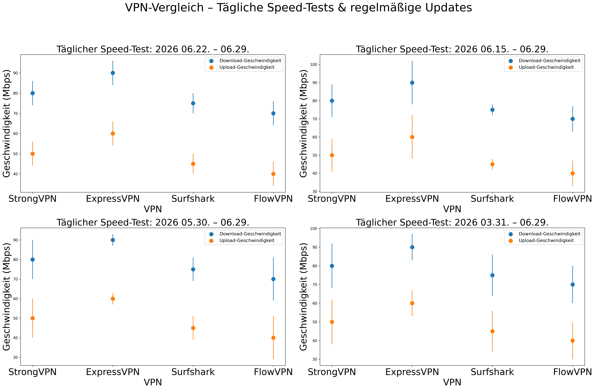

# Deutsche Mediatheken im Ausland: ARD, ZDF, Joyn und RTL+ mit VPN testen

Eine deutsche IP-Adresse ist der Anfang, aber nicht immer die ganze Lösung. ARD Mediathek, ZDF, Joyn, RTL+, WOW, Sky Go und DAZN können sich bei Rechten, Konten, Apps und Geräteprüfungen unterscheiden.

Dieser Leitfaden zeigt einen reproduzierbaren Test für Reisen und vorübergehende Aufenthalte. Er verspricht nicht, dass eine Plattform oder ein bestimmter Server dauerhaft funktioniert.

> **Schnelltest:** Mit einem deutschen Server verbinden, deutsche IP und DNS prüfen, privates Browserfenster öffnen, einen echten Stream 15 Minuten abspielen und Server, Uhrzeit, Gerät sowie Fehlermeldung notieren.

## Plattformen richtig auseinanderhalten

| Dienst | Zuerst prüfen | Typischer Fehler | Sinnvoller nächster Schritt |
|---|---|---|---|
| ARD Mediathek | Deutsche IP, Senderechte, Browser | Einzelne Sendung gesperrt | Andere Sendung testen, dann privaten Browser nutzen |
| ZDF | IP, Cookies, Live/VOD | Startseite lädt, Video nicht | Server wechseln und Cookies isolieren |
| Joyn | IP, Konto, App-Store | App nicht verfügbar oder falsche Region | Webversion vor App testen |
| RTL+ | Konto, Abo, IP | Login möglich, Wiedergabe blockiert | Vertrags- und Reisebedingungen prüfen |
| WOW / Sky Go / DAZN | Konto, Land, Gerät, IP | Standort- oder Gerätefehler | Kontoregion und registrierte Geräte prüfen |

Bei kostenpflichtigen Abos kann die EU-Portabilität für vorübergehende Reisen greifen. Prüfe zuerst die offiziellen Bedingungen deines Dienstes; ein VPN ist nicht immer erforderlich.

## VPN-Reihenfolge für den Praxistest

| Reihenfolge | VPN | Sinnvoll für | Vor Ablauf der Frist testen |
|---:|---|---|---|
| 1 | [StrongVPN](https://strongvpn.com/de/?tr_aid=60d96b5810e50&chan=w_github_de&data1=de-home&data2=hero) | Preisbewusster Einstieg für ein Jahr und alltägliche Nutzung | Deutscher Standort, Hauptplattform, Endpreis, Erstattung |
| 2 | [ExpressVPN](https://go.expressvpn.com/c/3828265/1509266/16063) | Nutzer, die mehr für einfache Apps und Support zahlen | TV-Gerät, gewünschter Dienst, Gesamt- und Verlängerungspreis |
| 3 | [Surfshark](https://get.surfshark.net/aff_c?offer_id=323&aff_id=5585&source=w_github&aff_sub=de) | Haushalte mit vielen Geräten | Lange Laufzeit, Steuer, gleichzeitige Nutzung, TV-App |
| 4 | [FlowVPN](https://www.flowvpx.com/sign-up/?locale=de&special=FREETRIAL&r=35-890485.w_github_de) | Kurzer Kompatibilitätstest | Testende, Kündigung, deutscher Server, Protokoll |

Affiliate-Hinweis: Wenn du über diese Links kaufst, kann VPN Welt eine Provision erhalten. Dein Preis erhöht sich dadurch nicht. Wir nennen deshalb ausdrücklich Fehlerquellen und Testschritte statt einer Erfolgsgarantie.

## 20-Minuten-Test im Browser

1. Fehlermeldung und Geschwindigkeit ohne VPN notieren.
2. Mit Deutschland verbinden und IP/DNS kontrollieren.
3. Privates Fenster öffnen, damit alte Länder-Cookies nicht stören.
4. Live-Stream und Mediathek-Inhalt getrennt testen.
5. Qualität von SD über HD bis 4K erhöhen.
6. Nach zehn Minuten einen zweiten Inhalt öffnen.
7. Bei Fehlern nur Server oder Protokoll ändern, nicht alles zugleich.

## Apps und Geräte

### Windows und macOS

Der Browser ist der beste Ausgangspunkt, weil Cookies und Erweiterungen leichter zu kontrollieren sind. Wenn die Webversion funktioniert, aber die App nicht, liegt das Problem wahrscheinlich nicht an der Grundverbindung.

### iPhone und Android

Joyn, RTL+ oder Sky Go können von App-Store-Region und Konto abhängen. Prüfe Standortberechtigungen und Store-Land, bevor du den VPN-Anbieter wechselst. Eine Store-Änderung kann Guthaben und Abos beeinflussen.

### Fire TV und Apple TV

Prüfe zuerst dieselbe Plattform auf einem Notebook im gleichen WLAN. Danach VPN-App, Store-Verfügbarkeit, Konto und Wiedergabe auf dem TV. Bei Router-Lösungen muss die ganze Verbindung getestet werden, nicht nur die Installation.

## Geschwindigkeit ist nicht gleich Freischaltung

Eine schnelle Verbindung kann trotzdem von einer Plattform erkannt werden. Die tägliche Grafik hilft, langfristige Tendenzen und starke Einbrüche zu sehen; sie ersetzt nicht den Mediatheken-Test auf deiner Leitung.

[Zur vollständigen Vergleichsmethodik und Preistabelle](../#tägliche-vpn-speedtests).

## Fehlersuche

### Nur einzelne Sendungen sind gesperrt

Das deutet eher auf Senderechte als auf einen vollständigen VPN-Block hin. Teste einen frei verfügbaren Beitrag und einen Live-Stream getrennt.

### IP ist deutsch, Plattform zeigt trotzdem Ausland

Privates Fenster, DNS-Prüfung, andere deutsche Stadt und geschlossene App-Sitzung testen. Alte Cookies oder IP-Reputation können das Ergebnis beeinflussen.

### Notebook funktioniert, Fernseher nicht

Die VPN-Route ist wahrscheinlich korrekt. Untersuche App-Store, Smart-TV-DNS, Konto und Router-Konfiguration.

### Stream startet, puffert aber abends

Serverauslastung und ISP-Route sind wahrscheinlicher als Geoblocking. Wechsle Standort oder Protokoll und teste mit Ethernet sowie 1080p.

## Kaufentscheidung

StrongVPN ist die erste preisbewusste Prüfung, ExpressVPN die teurere Komfort-Option, Surfshark die Lösung für viele Geräte und FlowVPN der kurze Test. Behalte nur den Anbieter, der deine echte Mediathek, dein Gerät und deine Abendverbindung innerhalb der Erstattungsfrist besteht.

[Zurück zu VPN Welt](../)
